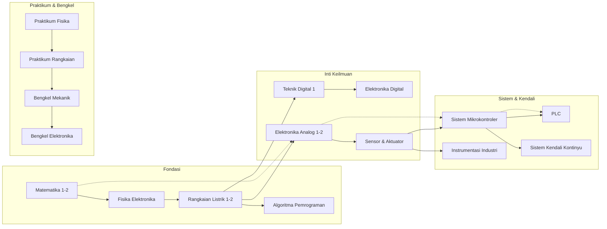

# 📘 Personal Learning Archive — M Faris

> _"Belajar bukan tentang menghafal, tapi tentang memahami pola dan membangun koneksi."_

---

## 🎯 Tentang Repository Ini

Repository ini adalah **arsip catatan belajar pribadi** untuk bidang **Teknik Elektronika & Kendali**. 
Dibuat sebagai ruang fleksibel untuk:
- 📝 Mencatat konsep, rumus, dan insight
- 🔬 Mendokumentasikan eksperimen dan simulasi
- 🧩 Menghubungkan antar topik lintas mata kuliah
- 📈 Melacak progres pemahaman secara mandiri

> ⚠️ **Bukan portofolio nilai** — tidak ada IPK, status kelulusan, atau target akademik formal.

---

## 🗺️ Peta Belajar Besar

---

## 📚 Navigasi Per Semester

| Semester | Tahun Akademik | Jumlah Matkul | Link |
|----------|----------------|---------------|------|
| 2024-1 | 2024 / 1 | 8 | [Lihat matkul](./semesters/2024-1/README.md) |
| 2024-2 | 2024 / 2 | 7 | [Lihat matkul](./semesters/2024-2/README.md) |
| 2025-1 | 2025 / 1 | 6 | [Lihat matkul](./semesters/2025-1/README.md) |

---

## 🔍 Topik Lintas-Matkul

Jelajahi topik yang menghubungkan beberapa mata kuliah sekaligus:

- ⚡ **Fourier Transform**: Matematika 2 → Elektronika Analog → Sistem Kendali
- 🔁 **PID Control**: Rangkaian Listrik → Sistem Kendali → PLC
- 💻 **Embedded Systems**: Algoritma → Mikrokontroler → Instrumentasi
- 📡 **Signal Processing**: Elektronika Digital → Sensor → Kendali

👉 **[Lihat semua topik lintas-matkul](topics/README.md)**

---

## 🛠️ Cara Menggunakan Repository Ini

1. **Pilih starting point**: Mulai dari semester mana saja atau topik yang paling menarik
2. **Isi template fleksibel**: Setiap mata kuliah punya struktur yang bisa kamu sesuaikan
3. **Buat koneksi**: Gunakan link internal untuk menghubungkan konsep antar matkul
4. **Update progres**: Checklist dan mindmap bisa diedit kapan saja

📖 **[Panduan lengkap](QUICKSTART.md)**

---

## 🔄 Update Terakhir

| Tanggal | Perubahan |
|---------|-----------|
| 2026-06-01 | Initial setup oleh script |

---

## 📬 Kontak & Kolaborasi

Repository ini bersifat **pribadi**, tapi jika kamu ingin berdiskusi atau berbagi sumber belajar:

- 📧 Email: _[isi sendiri]_
- 💬 GitHub Issues: _Untuk diskusi terbuka (opsional)_

---

_Dibuat dengan ❤️ untuk perjalanan belajar mandiri di Teknik Elektronika & Kendali_
