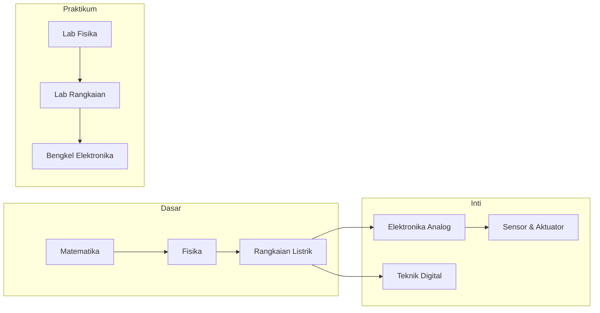

# Semester 2024-1 - 2024 / 1

> 📚 Daftar mata kuliah dan progres belajar semester ini.

---

## 📊 Ringkasan Semester

| Kode | Mata Kuliah | Kategori | Status |
|------|-------------|----------|--------|
| REC241001 | [Fisika Elektronika](./REC241001-fisika-elektronika/README.md) | Dasar | ⚪ Belum Mulai |
| REC241002 | [Praktikum Fisika Elektronika](./REC241002-praktikum-fisika-elektronika/README.md) | Praktikum | ⚪ Belum Mulai |
| REC241003 | [Matematika 1](./REC241003-matematika-1/README.md) | Dasar | ⚪ Belum Mulai |
| REC241004 | [K3 (Keselamatan & Kesehatan Kerja)](./REC241004-k3-keselamatan-dan-kesehatan-kerja/README.md) | Dasar | ⚪ Belum Mulai |
| REC241005 | [Rangkaian Listrik 1](./REC241005-rangkaian-listrik-1/README.md) | Inti | ⚪ Belum Mulai |
| REC241006 | [Praktikum Rangkaian Listrik 1](./REC241006-praktikum-rangkaian-listrik-1/README.md) | Praktikum | ⚪ Belum Mulai |
| REC241007 | [Bengkel Mekanik](./REC241007-bengkel-mekanik/README.md) | Praktikum | ⚪ Belum Mulai |
| REC241008 | [Algoritma Pemrograman](./REC241008-algoritma-pemrograman/README.md) | Dasar | ⚪ Belum Mulai |

> ✅ **Status**: Isi manual sesuai progresmu (Belum Mulai / Dalam Proses / Dipahami / Perlu Review)

---

## 🗺️ Alur Belajar Semester Ini



---

## 🎯 Target Pembelajaran Semester Ini

1. **Pemahaman Konsep**: Kuasai fondasi teori di setiap mata kuliah
2. **Keterampilan Praktis**: Selesaikan minimal 1 proyek kecil per matkul praktikum
3. **Koneksi Antar Topik**: Identifikasi hubungan antara mata kuliah (misal: Matematika → Rangkaian → Kontrol)

---

## 📁 Struktur Folder

```
2024-1/
├── REC241001-fisika-elektronika/
│   ├── README.md       # Template belajar fleksibel
│   ├── notes/          # Catatan harian, konsep, ringkasan
│   ├── problems/       # Soal latihan & pembahasan
│   ├── labs/           # Laporan praktikum, skema, hasil simulasi
│   └── references/     # Link buku, video, paper, datasheet
├── ...
└── (lihat navigasi cepat di bawah)
```

---

## 🔗 Navigasi Cepat

- 📘 [Fisika Elektronika](./REC241001-fisika-elektronika/README.md)
- 📘 [Praktikum Fisika Elektronika](./REC241002-praktikum-fisika-elektronika/README.md)
- 📘 [Matematika 1](./REC241003-matematika-1/README.md)
- 📘 [K3 (Keselamatan & Kesehatan Kerja)](./REC241004-k3-keselamatan-dan-kesehatan-kerja/README.md)
- 📘 [Rangkaian Listrik 1](./REC241005-rangkaian-listrik-1/README.md)
- 📘 [Praktikum Rangkaian Listrik 1](./REC241006-praktikum-rangkaian-listrik-1/README.md)
- 📘 [Bengkel Mekanik](./REC241007-bengkel-mekanik/README.md)
- 📘 [Algoritma Pemrograman](./REC241008-algoritma-pemrograman/README.md)

---

**[⬅️ Kembali ke Dashboard Utama](../../README.md)** | **[➡️ Lanjut ke Topik Lintas-Matkul](../../topics/README.md)**
