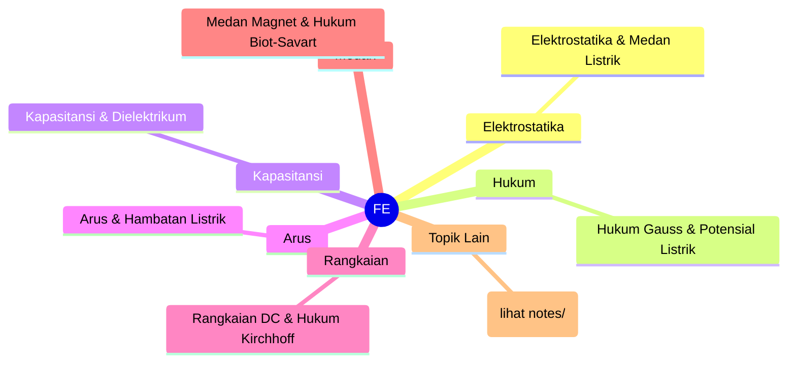
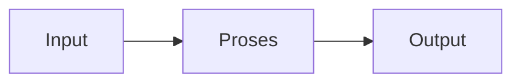

# Fisika Elektronika (REC241001)
> Bidang: Dasar | Target Pemahaman: _Saya isi sendiri_

---

## 🗺️ Peta Topik




> 💡 **Tips**: Edit mindmap di atas sesuai pemahamanmu. Tambahkan cabang baru saat mempelajari konsep tambahan.

---

## 📌 Fokus Belajar Saat Ini

- [ ] Review daftar topik di bawah
- [ ] Pilih 1-2 topik untuk dipelajari minggu ini
- [ ] Kerjakan latihan soal terkait
- [ ] Dokumentasikan insight di notes/

### Daftar Topik Lengkap

- [ ] Elektrostatika & Medan Listrik
- [ ] Hukum Gauss & Potensial Listrik
- [ ] Kapasitansi & Dielektrikum
- [ ] Arus & Hambatan Listrik
- [ ] Rangkaian DC & Hukum Kirchhoff
- [ ] Medan Magnet & Hukum Biot-Savart
- [ ] Hukum Faraday & Induktansi
- [ ] Rangkaian AC & Impedansi
- [ ] Gelombang Elektromagnetik
- [ ] Optika & Serat Optik


---

## 📐 Konsep & Rumus Kunci

> Tulis penjelasan konsep dengan bahasamu sendiri di sini.

| Nama | Rumus |
|------|-------|
| Hukum Coulomb | `$$ F = k \frac{q_1 q_2}{r^2} $$` |
| Medan Listrik | `$$ E = \frac{F}{q} = k \frac{Q}{r^2} $$` |
| Hukum Ohm | `$$ V = I \cdot R $$` |
| Daya Listrik | `$$ P = V \cdot I = I^2 R = \frac{V^2}{R} $$` |
| Induktansi | `$$ V_L = L \frac{dI}{dt} $$` |
| Impedansi Kapasitor | `$$ X_C = \frac{1}{\omega C} $$` |
| Impedansi Induktor | `$$ X_L = \omega L $$` |
| Frekuensi Gelombang EM | `$$ c = \lambda \cdot f $$` |


### Catatan Pemahaman

| Konsep | Pemahaman Saya | Contoh Aplikasi | Masih Bingung? |
|--------|----------------|-----------------|----------------|
| ... | ... | ... | [ ] Ya / [x] Tidak |

---

## 🔧 Praktikum / Simulasi

### Eksperimen yang Tersedia

- [ ] Pengukuran medan listrik dengan elektroskop
- [ ] Verifikasi hukum Ohm dan Kirchhoff
- [ ] Pengukuran kapasitansi dan induktansi
- [ ] Observasi gelombang EM dengan antenna dipole
- [ ] Eksperimen optika: refleksi, refraksi, interferensi


### Template Laporan Praktikum

```markdown
## Judul Percobaan: ________________

### Tujuan
- 

### Alat & Bahan
- 

### Skema Rangkaian / Setup


### Langkah Kerja
1. 
2. 
3. 

### Hasil Pengamatan

| No | Parameter | Nilai Teori | Nilai Praktik | Error (%) |
|----|-----------|-------------|---------------|-----------|
| 1  |           |             |               |           |

### Analisis & Kesimpulan


```

---

## ❓ Catatan Pertanyaan & Insight

> Tempat mencatat: "Kenapa begini?", "Bagaimana jika...?", "Hubungan dengan topik X?"

### 💡 Insight Hari Ini
- 

### 🔍 Pertanyaan yang Belum Terjawab
- 

### 🔗 Koneksi ke Topik Lain
- Lihat juga: [Matkul Terkait](../../README.md)

---

## 🔗 Referensi Saya

### Buku Wajib
- [ ] Fundamentals of Physics - Halliday, Resnick, Walker
- [ ] University Physics - Young & Freedman
- [ ] Physics for Scientists and Engineers - Serway
- [ ] MIT OpenCourseWare: Electricity and Magnetism


### Video Tutorial
- [ ] YouTube: Cari channel "GreatScott!", "EEVblog", "The Engineering Mindset"
- [ ] Coursera / edX courses

### Datasheet & Manual
- [ ] [DigiKey](https://www.digikey.com/)
- [ ] [Mouser](https://www.mouser.com/)
- [ ] [AllAboutCircuits](https://www.allaboutcircuits.com/)

### Simulator Online
- [ ] [Falstad Circuit Simulator](https://falstad.com/circuit/)
- [ ] [LTspice](https://www.analog.com/en/design-center/design-tools-and-calculators/ltspice-simulator.html)
- [ ] [Tinkercad](https://www.tinkercad.com/)

---

## 🔄 Riwayat Update

| Tanggal | Progress | Catatan |
|---------|----------|---------|
| 2026-06-01 | Initial setup | Script auto-fill konten |

---

**[⬅️ Kembali ke Dashboard Semester](../README.md)** | **[🏠 Ke Dashboard Utama](../../README.md)**

---

> 📝 **Catatan**: Template ini sudah diisi dengan konten spesifik Fisika Elektronika. 
> Edit sesuai kebutuhan, tambah catatan pribadi, dan lengkapi dengan pemahamanmu sendiri!
