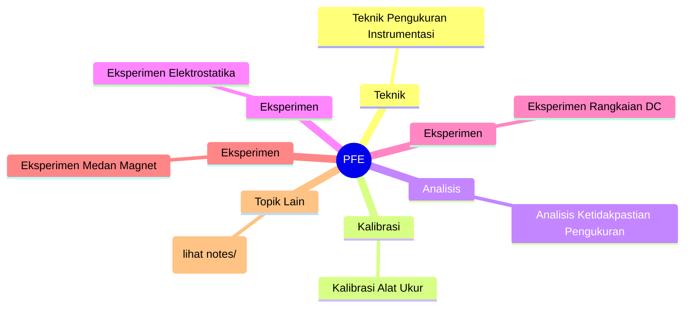
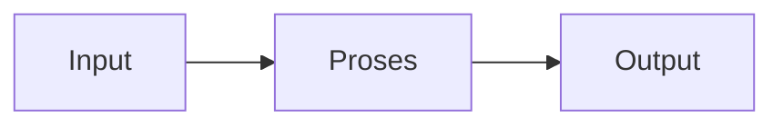

# Praktikum Fisika Elektronika (REC241002)
> Bidang: Dasar | Target Pemahaman: _Saya isi sendiri_

---

## 🗺️ Peta Topik




> 💡 **Tips**: Edit mindmap di atas sesuai pemahamanmu. Tambahkan cabang baru saat mempelajari konsep tambahan.

---

## 📌 Fokus Belajar Saat Ini

- [ ] Review daftar topik di bawah
- [ ] Pilih 1-2 topik untuk dipelajari minggu ini
- [ ] Kerjakan latihan soal terkait
- [ ] Dokumentasikan insight di notes/

### Daftar Topik Lengkap

- [ ] Teknik Pengukuran Instrumentasi
- [ ] Kalibrasi Alat Ukur
- [ ] Analisis Ketidakpastian Pengukuran
- [ ] Eksperimen Elektrostatika
- [ ] Eksperimen Rangkaian DC
- [ ] Eksperimen Medan Magnet
- [ ] Eksperimen Induksi Elektromagnetik
- [ ] Eksperimen Rangkaian AC
- [ ] Eksperimen Gelombang & Optika
- [ ] Pelaporan Hasil Praktikum


---

## 📐 Konsep & Rumus Kunci

> Tulis penjelasan konsep dengan bahasamu sendiri di sini.

| Nama | Rumus |
|------|-------|
| Ketidakpastian Relatif | `$$ \delta = \frac{\Delta x}{x} \times 100\% $$` |
| Ralat Gabungan | `$$ \Delta z = \sqrt{\left(\frac{\partial z}{\partial x}\Delta x\right)^2 + \left(\frac{\partial z}{\partial y}\Delta y\right)^2} $$` |
| Regresi Linear | `$$ y = mx + c, \quad m = \frac{n\sum xy - \sum x \sum y}{n\sum x^2 - (\sum x)^2} $$` |


### Catatan Pemahaman

| Konsep | Pemahaman Saya | Contoh Aplikasi | Masih Bingung? |
|--------|----------------|-----------------|----------------|
| ... | ... | ... | [ ] Ya / [x] Tidak |

---

## 🔧 Praktikum / Simulasi

### Eksperimen yang Tersedia

- [ ] Modul 1: Pengukuran dasar dengan multimeter & osiloskop
- [ ] Modul 2: Hukum Coulomb dan medan listrik
- [ ] Modul 3: Rangkaian seri-paralel resistor
- [ ] Modul 4: Hukum Kirchhoff arus dan tegangan
- [ ] Modul 5: Medan magnet solenoida
- [ ] Modul 6: Induksi elektromagnetik


### Template Laporan Praktikum

```markdown
## Judul Percobaan: ________________

### Tujuan
- 

### Alat & Bahan
- 

### Skema Rangkaian / Setup


### Langkah Kerja
1. 
2. 
3. 

### Hasil Pengamatan

| No | Parameter | Nilai Teori | Nilai Praktik | Error (%) |
|----|-----------|-------------|---------------|-----------|
| 1  |           |             |               |           |

### Analisis & Kesimpulan


```

---

## ❓ Catatan Pertanyaan & Insight

> Tempat mencatat: "Kenapa begini?", "Bagaimana jika...?", "Hubungan dengan topik X?"

### 💡 Insight Hari Ini
- 

### 🔍 Pertanyaan yang Belum Terjawab
- 

### 🔗 Koneksi ke Topik Lain
- Lihat juga: [Matkul Terkait](../../README.md)

---

## 🔗 Referensi Saya

### Buku Wajib
- [ ] Manual Praktikum Fisika Dasar - Laboratorium Fisika
- [ ] The Art of Experimental Physics - Melissinos
- [ ] Data Reduction and Error Analysis - Bevington


### Video Tutorial
- [ ] YouTube: Cari channel "GreatScott!", "EEVblog", "The Engineering Mindset"
- [ ] Coursera / edX courses

### Datasheet & Manual
- [ ] [DigiKey](https://www.digikey.com/)
- [ ] [Mouser](https://www.mouser.com/)
- [ ] [AllAboutCircuits](https://www.allaboutcircuits.com/)

### Simulator Online
- [ ] [Falstad Circuit Simulator](https://falstad.com/circuit/)
- [ ] [LTspice](https://www.analog.com/en/design-center/design-tools-and-calculators/ltspice-simulator.html)
- [ ] [Tinkercad](https://www.tinkercad.com/)

---

## 🔄 Riwayat Update

| Tanggal | Progress | Catatan |
|---------|----------|---------|
| 2026-06-01 | Initial setup | Script auto-fill konten |

---

**[⬅️ Kembali ke Dashboard Semester](../README.md)** | **[🏠 Ke Dashboard Utama](../../README.md)**

---

> 📝 **Catatan**: Template ini sudah diisi dengan konten spesifik Praktikum Fisika Elektronika. 
> Edit sesuai kebutuhan, tambah catatan pribadi, dan lengkapi dengan pemahamanmu sendiri!
