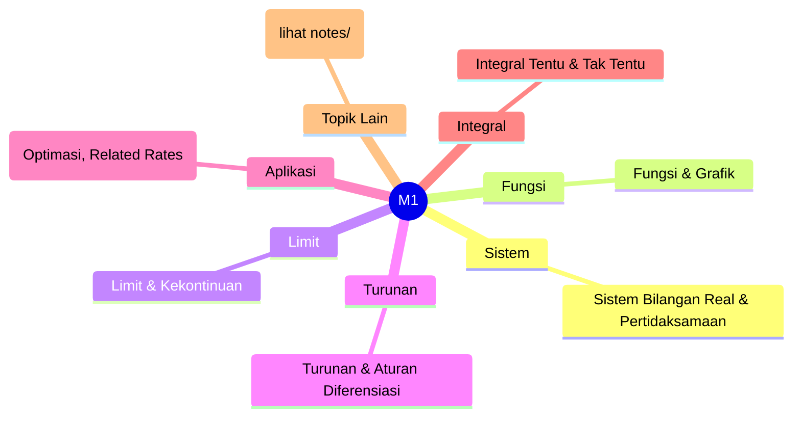
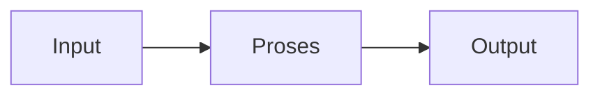

# Matematika 1 (REC241003)
> Bidang: Dasar | Target Pemahaman: _Saya isi sendiri_

---

## 🗺️ Peta Topik




> 💡 **Tips**: Edit mindmap di atas sesuai pemahamanmu. Tambahkan cabang baru saat mempelajari konsep tambahan.

---

## 📌 Fokus Belajar Saat Ini

- [ ] Review daftar topik di bawah
- [ ] Pilih 1-2 topik untuk dipelajari minggu ini
- [ ] Kerjakan latihan soal terkait
- [ ] Dokumentasikan insight di notes/

### Daftar Topik Lengkap

- [ ] Sistem Bilangan Real & Pertidaksamaan
- [ ] Fungsi & Grafik
- [ ] Limit & Kekontinuan
- [ ] Turunan & Aturan Diferensiasi
- [ ] Aplikasi Turunan (Optimasi, Related Rates)
- [ ] Integral Tentu & Tak Tentu
- [ ] Teknik Integrasi (Substitusi, Parsial)
- [ ] Aplikasi Integral (Luas, Volume)
- [ ] Fungsi Transenden (Exp, Log, Trigonometri)
- [ ] Deret & Kekonvergenan


---

## 📐 Konsep & Rumus Kunci

> Tulis penjelasan konsep dengan bahasamu sendiri di sini.

| Nama | Rumus |
|------|-------|
| Definisi Limit | `$$ \lim_{x \to a} f(x) = L $$` |
| Definisi Turunan | `$$ f'(x) = \lim_{h \to 0} \frac{f(x+h) - f(x)}{h} $$` |
| Aturan Rantai | `$$ \frac{d}{dx}[f(g(x))] = f'(g(x)) \cdot g'(x) $$` |
| Integral Tentu | `$$ \int_a^b f(x) dx = F(b) - F(a) $$` |
| Integral Parsial | `$$ \int u dv = uv - \int v du $$` |
| Deret Taylor | `$$ f(x) = \sum_{n=0}^{\infty} \frac{f^{(n)}(a)}{n!}(x-a)^n $$` |
| Deret Geometri | `$$ \sum_{n=0}^{\infty} ar^n = \frac{a}{1-r}, |r| < 1 $$` |


### Catatan Pemahaman

| Konsep | Pemahaman Saya | Contoh Aplikasi | Masih Bingung? |
|--------|----------------|-----------------|----------------|
| ... | ... | ... | [ ] Ya / [x] Tidak |

---

## 🔧 Praktikum / Simulasi

### Eksperimen yang Tersedia

- [ ] Visualisasi limit dan kekontinuan dengan Python/MATLAB
- [ ] Simulasi aplikasi turunan untuk optimasi
- [ ] Perhitungan luas dan volume dengan integral numerik
- [ ] Plot fungsi transenden dan deret Fourier


### Template Laporan Praktikum

```markdown
## Judul Percobaan: ________________

### Tujuan
- 

### Alat & Bahan
- 

### Skema Rangkaian / Setup


### Langkah Kerja
1. 
2. 
3. 

### Hasil Pengamatan

| No | Parameter | Nilai Teori | Nilai Praktik | Error (%) |
|----|-----------|-------------|---------------|-----------|
| 1  |           |             |               |           |

### Analisis & Kesimpulan


```

---

## ❓ Catatan Pertanyaan & Insight

> Tempat mencatat: "Kenapa begini?", "Bagaimana jika...?", "Hubungan dengan topik X?"

### 💡 Insight Hari Ini
- 

### 🔍 Pertanyaan yang Belum Terjawab
- 

### 🔗 Koneksi ke Topik Lain
- Lihat juga: [Matkul Terkait](../../README.md)

---

## 🔗 Referensi Saya

### Buku Wajib
- [ ] Calculus - James Stewart
- [ ] Calculus: Early Transcendentals - Anton
- [ ] Pure Mathematics - G.N. Berman
- [ ] Khan Academy: Calculus


### Video Tutorial
- [ ] YouTube: Cari channel "GreatScott!", "EEVblog", "The Engineering Mindset"
- [ ] Coursera / edX courses

### Datasheet & Manual
- [ ] [DigiKey](https://www.digikey.com/)
- [ ] [Mouser](https://www.mouser.com/)
- [ ] [AllAboutCircuits](https://www.allaboutcircuits.com/)

### Simulator Online
- [ ] [Falstad Circuit Simulator](https://falstad.com/circuit/)
- [ ] [LTspice](https://www.analog.com/en/design-center/design-tools-and-calculators/ltspice-simulator.html)
- [ ] [Tinkercad](https://www.tinkercad.com/)

---

## 🔄 Riwayat Update

| Tanggal | Progress | Catatan |
|---------|----------|---------|
| 2026-06-01 | Initial setup | Script auto-fill konten |

---

**[⬅️ Kembali ke Dashboard Semester](../README.md)** | **[🏠 Ke Dashboard Utama](../../README.md)**

---

> 📝 **Catatan**: Template ini sudah diisi dengan konten spesifik Matematika 1. 
> Edit sesuai kebutuhan, tambah catatan pribadi, dan lengkapi dengan pemahamanmu sendiri!
