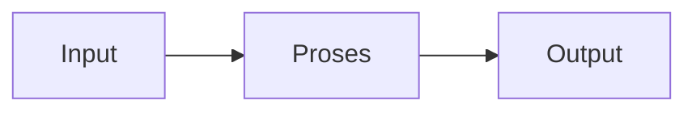

# K3 (Keselamatan & Kesehatan Kerja) (REC241004)
> Bidang: Dasar | Target Pemahaman: _Saya isi sendiri_

---

## 🗺️ Peta Topik

```mermaid
mindmap
  root((K(&))
    Konsep
      Konsep Dasar K3 & Regulasi
    Identifikasi
      Identifikasi Bahaya & Risiko
    APD
      APD (Alat Pelindung Diri)
    K3
      K3 Listrik & Sengatan Elektrik
    K3
      K3 Kebakaran & Sistem Proteksi
    K3
      K3 Bahan Kimia & MSDS
    Topik Lain
      (lihat notes/)
```


> 💡 **Tips**: Edit mindmap di atas sesuai pemahamanmu. Tambahkan cabang baru saat mempelajari konsep tambahan.

---

## 📌 Fokus Belajar Saat Ini

- [ ] Review daftar topik di bawah
- [ ] Pilih 1-2 topik untuk dipelajari minggu ini
- [ ] Kerjakan latihan soal terkait
- [ ] Dokumentasikan insight di notes/

### Daftar Topik Lengkap

- [ ] Konsep Dasar K3 & Regulasi
- [ ] Identifikasi Bahaya & Risiko
- [ ] APD (Alat Pelindung Diri)
- [ ] K3 Listrik & Sengatan Elektrik
- [ ] K3 Kebakaran & Sistem Proteksi
- [ ] K3 Bahan Kimia & MSDS
- [ ] Ergonomi & Kesehatan Kerja
- [ ] Prosedur Darurat & Evakuasi
- [ ] Investigasi Kecelakaan Kerja
- [ ] Sistem Manajemen K3 (SMK3)


---

## 📐 Konsep & Rumus Kunci

> Tulis penjelasan konsep dengan bahasamu sendiri di sini.

| Nama | Rumus |
|------|-------|
| Risk Matrix | `$$ Risk = Probability \times Severity $$` |
| Nilai Ambang Batas | `$$ TWA = \frac{C_1 T_1 + C_2 T_2 + \dots + C_n T_n}{T_1 + T_2 + \dots + T_n} $$` |
| Tahanan Tubuh Manusia | `$$ R_{body} \approx 1000\Omega - 100k\Omega (kulit kering) $$` |


### Catatan Pemahaman

| Konsep | Pemahaman Saya | Contoh Aplikasi | Masih Bingung? |
|--------|----------------|-----------------|----------------|
| ... | ... | ... | [ ] Ya / [x] Tidak |

---

## 🔧 Praktikum / Simulasi

### Eksperimen yang Tersedia

- [ ] Inspeksi K3 laboratorium
- [ ] Pemilihan dan penggunaan APD yang tepat
- [ ] Simulasi pemadaman kebakaran (APAR)
- [ ] Pembacaan MSDS bahan kimia
- [ ] Penyusunan Job Safety Analysis (JSA)
- [ ] Drill evakuasi darurat


### Template Laporan Praktikum

```markdown
## Judul Percobaan: ________________

### Tujuan
- 

### Alat & Bahan
- 

### Skema Rangkaian / Setup


### Langkah Kerja
1. 
2. 
3. 

### Hasil Pengamatan

| No | Parameter | Nilai Teori | Nilai Praktik | Error (%) |
|----|-----------|-------------|---------------|-----------|
| 1  |           |             |               |           |

### Analisis & Kesimpulan


```

---

## ❓ Catatan Pertanyaan & Insight

> Tempat mencatat: "Kenapa begini?", "Bagaimana jika...?", "Hubungan dengan topik X?"

### 💡 Insight Hari Ini
- 

### 🔍 Pertanyaan yang Belum Terjawab
- 

### 🔗 Koneksi ke Topik Lain
- Lihat juga: [Matkul Terkait](../../README.md)

---

## 🔗 Referensi Saya

### Buku Wajib
- [ ] Undang-Undang No. 1 Tahun 1970 tentang Keselamatan Kerja
- [ ] Permenaker No. 5 Tahun 2018 tentang K3 Lingkungan Kerja
- [ ] OSHA Standards
- [ ] NFPA 70E: Electrical Safety in the Workplace


### Video Tutorial
- [ ] YouTube: Cari channel "GreatScott!", "EEVblog", "The Engineering Mindset"
- [ ] Coursera / edX courses

### Datasheet & Manual
- [ ] [DigiKey](https://www.digikey.com/)
- [ ] [Mouser](https://www.mouser.com/)
- [ ] [AllAboutCircuits](https://www.allaboutcircuits.com/)

### Simulator Online
- [ ] [Falstad Circuit Simulator](https://falstad.com/circuit/)
- [ ] [LTspice](https://www.analog.com/en/design-center/design-tools-and-calculators/ltspice-simulator.html)
- [ ] [Tinkercad](https://www.tinkercad.com/)

---

## 🔄 Riwayat Update

| Tanggal | Progress | Catatan |
|---------|----------|---------|
| 2026-06-01 | Initial setup | Script auto-fill konten |

---

**[⬅️ Kembali ke Dashboard Semester](../README.md)** | **[🏠 Ke Dashboard Utama](../../README.md)**

---

> 📝 **Catatan**: Template ini sudah diisi dengan konten spesifik K3 (Keselamatan & Kesehatan Kerja). 
> Edit sesuai kebutuhan, tambah catatan pribadi, dan lengkapi dengan pemahamanmu sendiri!
