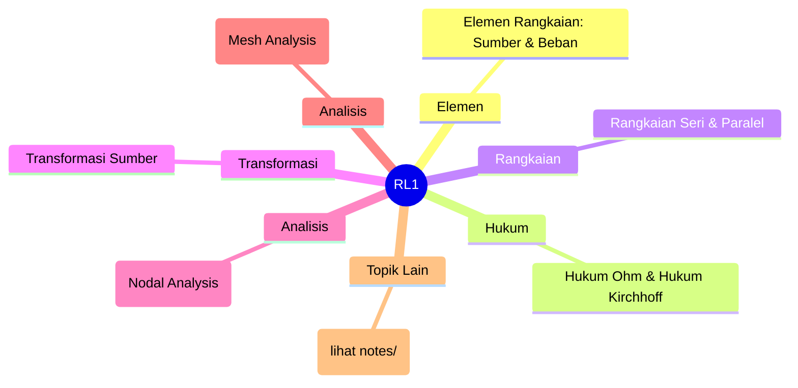
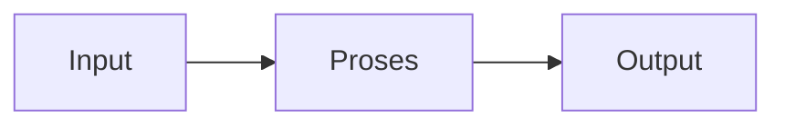

# Rangkaian Listrik 1 (REC241005)
> Bidang: Dasar | Target Pemahaman: _Saya isi sendiri_

---

## 🗺️ Peta Topik




> 💡 **Tips**: Edit mindmap di atas sesuai pemahamanmu. Tambahkan cabang baru saat mempelajari konsep tambahan.

---

## 📌 Fokus Belajar Saat Ini

- [ ] Review daftar topik di bawah
- [ ] Pilih 1-2 topik untuk dipelajari minggu ini
- [ ] Kerjakan latihan soal terkait
- [ ] Dokumentasikan insight di notes/

### Daftar Topik Lengkap

- [ ] Elemen Rangkaian: Sumber & Beban
- [ ] Hukum Ohm & Hukum Kirchhoff
- [ ] Rangkaian Seri & Paralel
- [ ] Transformasi Sumber
- [ ] Analisis Node (Nodal Analysis)
- [ ] Analisis Mesh (Mesh Analysis)
- [ ] Teorema Thevenin & Norton
- [ ] Teorema Superposisi
- [ ] Transfer Daya Maksimum
- [ ] Rangkaian Orde Pertama (RC, RL)


---

## 📐 Konsep & Rumus Kunci

> Tulis penjelasan konsep dengan bahasamu sendiri di sini.

| Nama | Rumus |
|------|-------|
| Hukum Ohm | `$$ V = I \cdot R $$` |
| KCL | `$$ \sum I_{masuk} = \sum I_{keluar} $$` |
| KVL | `$$ \sum V = 0 $$` |
| Resistor Seri | `$$ R_{eq} = R_1 + R_2 + \dots $$` |
| Resistor Paralel | `$$ \frac{1}{R_{eq}} = \frac{1}{R_1} + \frac{1}{R_2} + \dots $$` |
| Thevenin | `$$ V_{th}, R_{th} $$` |
| Norton | `$$ I_N, R_N = R_{th} $$` |
| Waktu RC | `$$ \tau = RC $$` |


### Catatan Pemahaman

| Konsep | Pemahaman Saya | Contoh Aplikasi | Masih Bingung? |
|--------|----------------|-----------------|----------------|
| ... | ... | ... | [ ] Ya / [x] Tidak |

---

## 🔧 Praktikum / Simulasi

### Eksperimen yang Tersedia

- [ ] Verifikasi hukum Ohm dan Kirchhoff
- [ ] Analisis rangkaian seri-paralel
- [ ] Eksperimen teorema Thevenin-Norton
- [ ] Superposisi pada rangkaian multi-sumber
- [ ] Respons transient RC dan RL
- [ ] Simulasi dengan LTspice/Multisim


### Template Laporan Praktikum

```markdown
## Judul Percobaan: ________________

### Tujuan
- 

### Alat & Bahan
- 

### Skema Rangkaian / Setup


### Langkah Kerja
1. 
2. 
3. 

### Hasil Pengamatan

| No | Parameter | Nilai Teori | Nilai Praktik | Error (%) |
|----|-----------|-------------|---------------|-----------|
| 1  |           |             |               |           |

### Analisis & Kesimpulan


```

---

## ❓ Catatan Pertanyaan & Insight

> Tempat mencatat: "Kenapa begini?", "Bagaimana jika...?", "Hubungan dengan topik X?"

### 💡 Insight Hari Ini
- 

### 🔍 Pertanyaan yang Belum Terjawab
- 

### 🔗 Koneksi ke Topik Lain
- Lihat juga: [Matkul Terkait](../../README.md)

---

## 🔗 Referensi Saya

### Buku Wajib
- [ ] Electric Circuits - Nilsson & Riedel
- [ ] Engineering Circuit Analysis - Hayt & Kemmerly
- [ ] Fundamentals of Electric Circuits - Alexander & Sadiku
- [ ] All About Circuits (online)


### Video Tutorial
- [ ] YouTube: Cari channel "GreatScott!", "EEVblog", "The Engineering Mindset"
- [ ] Coursera / edX courses

### Datasheet & Manual
- [ ] [DigiKey](https://www.digikey.com/)
- [ ] [Mouser](https://www.mouser.com/)
- [ ] [AllAboutCircuits](https://www.allaboutcircuits.com/)

### Simulator Online
- [ ] [Falstad Circuit Simulator](https://falstad.com/circuit/)
- [ ] [LTspice](https://www.analog.com/en/design-center/design-tools-and-calculators/ltspice-simulator.html)
- [ ] [Tinkercad](https://www.tinkercad.com/)

---

## 🔄 Riwayat Update

| Tanggal | Progress | Catatan |
|---------|----------|---------|
| 2026-06-01 | Initial setup | Script auto-fill konten |

---

**[⬅️ Kembali ke Dashboard Semester](../README.md)** | **[🏠 Ke Dashboard Utama](../../README.md)**

---

> 📝 **Catatan**: Template ini sudah diisi dengan konten spesifik Rangkaian Listrik 1. 
> Edit sesuai kebutuhan, tambah catatan pribadi, dan lengkapi dengan pemahamanmu sendiri!
