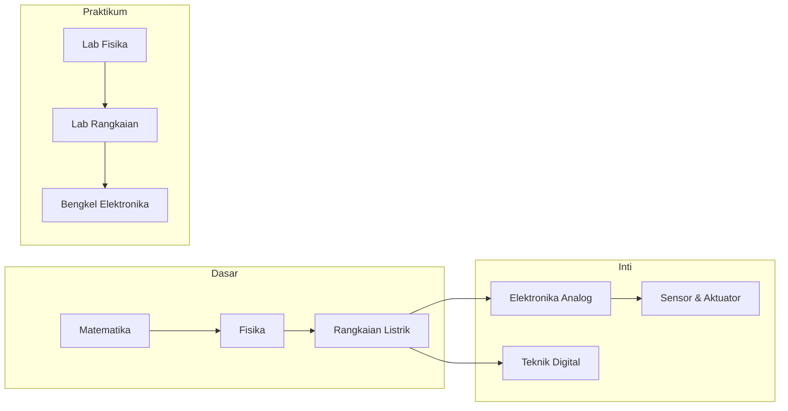

# Semester 2024-2 - 2024 / 2

> 📚 Daftar mata kuliah dan progres belajar semester ini.

---

## 📊 Ringkasan Semester

| Kode | Mata Kuliah | Kategori | Status |
|------|-------------|----------|--------|
| REC242001 | [Rangkaian Listrik 2](./REC242001-rangkaian-listrik-2/README.md) | Inti | ⚪ Belum Mulai |
| REC242002 | [Elektronika Analog 1](./REC242002-elektronika-analog-1/README.md) | Inti | ⚪ Belum Mulai |
| REC242003 | [Bengkel Elektronika](./REC242003-bengkel-elektronika/README.md) | Praktikum | ⚪ Belum Mulai |
| REC242004 | [Sensor & Aktuator](./REC242004-sensor-dan-aktuator/README.md) | Inti | ⚪ Belum Mulai |
| REC242005 | [Teknik Digital 1](./REC242005-teknik-digital-1/README.md) | Inti | ⚪ Belum Mulai |
| REC242006 | [Matematika 2](./REC242006-matematika-2/README.md) | Dasar | ⚪ Belum Mulai |
| REC242007 | [Gambar Teknik](./REC242007-gambar-teknik/README.md) | Dasar | ⚪ Belum Mulai |

> ✅ **Status**: Isi manual sesuai progresmu (Belum Mulai / Dalam Proses / Dipahami / Perlu Review)

---

## 🗺️ Alur Belajar Semester Ini



---

## 🎯 Target Pembelajaran Semester Ini

1. **Pemahaman Konsep**: Kuasai fondasi teori di setiap mata kuliah
2. **Keterampilan Praktis**: Selesaikan minimal 1 proyek kecil per matkul praktikum
3. **Koneksi Antar Topik**: Identifikasi hubungan antara mata kuliah (misal: Matematika → Rangkaian → Kontrol)

---

## 📁 Struktur Folder

```
2024-2/
├── REC242001-rangkaian-listrik-2/
│   ├── README.md       # Template belajar fleksibel
│   ├── notes/          # Catatan harian, konsep, ringkasan
│   ├── problems/       # Soal latihan & pembahasan
│   ├── labs/           # Laporan praktikum, skema, hasil simulasi
│   └── references/     # Link buku, video, paper, datasheet
├── ...
└── (lihat navigasi cepat di bawah)
```

---

## 🔗 Navigasi Cepat

- 📘 [Rangkaian Listrik 2](./REC242001-rangkaian-listrik-2/README.md)
- 📘 [Elektronika Analog 1](./REC242002-elektronika-analog-1/README.md)
- 📘 [Bengkel Elektronika](./REC242003-bengkel-elektronika/README.md)
- 📘 [Sensor & Aktuator](./REC242004-sensor-dan-aktuator/README.md)
- 📘 [Teknik Digital 1](./REC242005-teknik-digital-1/README.md)
- 📘 [Matematika 2](./REC242006-matematika-2/README.md)
- 📘 [Gambar Teknik](./REC242007-gambar-teknik/README.md)

---

**[⬅️ Kembali ke Dashboard Utama](../../README.md)** | **[➡️ Lanjut ke Topik Lintas-Matkul](../../topics/README.md)**
