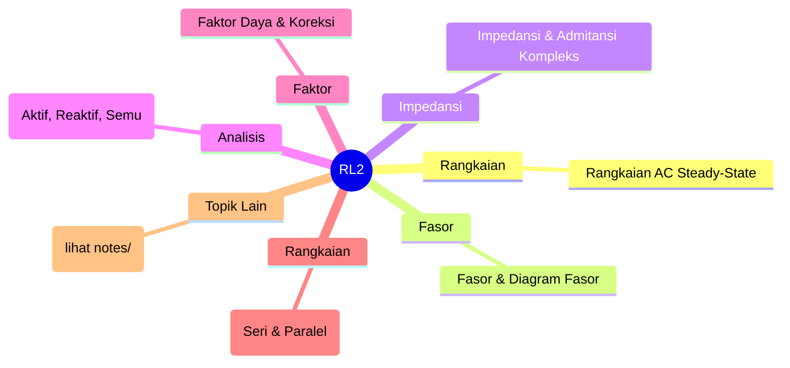
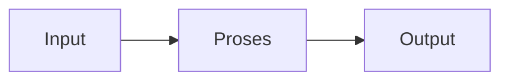

# Rangkaian Listrik 2 (REC242001)
> Bidang: Dasar | Target Pemahaman: _Saya isi sendiri_

---

## 🗺️ Peta Topik




> 💡 **Tips**: Edit mindmap di atas sesuai pemahamanmu. Tambahkan cabang baru saat mempelajari konsep tambahan.

---

## 📌 Fokus Belajar Saat Ini

- [ ] Review daftar topik di bawah
- [ ] Pilih 1-2 topik untuk dipelajari minggu ini
- [ ] Kerjakan latihan soal terkait
- [ ] Dokumentasikan insight di notes/

### Daftar Topik Lengkap

- [ ] Rangkaian AC Steady-State
- [ ] Fasor & Diagram Fasor
- [ ] Impedansi & Admitansi Kompleks
- [ ] Analisis Daya AC (Aktif, Reaktif, Semu)
- [ ] Faktor Daya & Koreksi
- [ ] Rangkaian Resonansi (Seri & Paralel)
- [ ] Rangkaian Kopling Magnetik
- [ ] Transformator Ideal & Non-Ideal
- [ ] Rangkaian Tiga Fasa
- [ ] Filter Pasif (LPF, HPF, BPF, BSF)


---

## 📐 Konsep & Rumus Kunci

> Tulis penjelasan konsep dengan bahasamu sendiri di sini.

| Nama | Rumus |
|------|-------|
| Fasor | `$$ V = V_m \angle \theta = V_m e^{j\theta} $$` |
| Impedansi | `$$ Z = R + jX = |Z|\angle\phi $$` |
| Daya Kompleks | `$$ S = P + jQ = VI^* $$` |
| Faktor Daya | `$$ pf = \cos\phi = \frac{P}{S} $$` |
| Resonansi | `$$ \omega_0 = \frac{1}{\sqrt{LC}} $$` |
| Faktor Kualitas | `$$ Q = \frac{\omega_0 L}{R} = \frac{1}{\omega_0 RC} $$` |
| Daya 3-Fasa | `$$ P = \sqrt{3} V_L I_L \cos\phi $$` |


### Catatan Pemahaman

| Konsep | Pemahaman Saya | Contoh Aplikasi | Masih Bingung? |
|--------|----------------|-----------------|----------------|
| ... | ... | ... | [ ] Ya / [x] Tidak |

---

## 🔧 Praktikum / Simulasi

### Eksperimen yang Tersedia

- [ ] Analisis fasor dengan osiloskop
- [ ] Pengukuran daya AC & faktor daya
- [ ] Eksperimen resonansi RLC
- [ ] Karakterisasi transformator
- [ ] Rangkaian tiga fasa bintang-delta
- [ ] Desain filter pasif


### Template Laporan Praktikum

```markdown
## Judul Percobaan: ________________

### Tujuan
- 

### Alat & Bahan
- 

### Skema Rangkaian / Setup


### Langkah Kerja
1. 
2. 
3. 

### Hasil Pengamatan

| No | Parameter | Nilai Teori | Nilai Praktik | Error (%) |
|----|-----------|-------------|---------------|-----------|
| 1  |           |             |               |           |

### Analisis & Kesimpulan


```

---

## ❓ Catatan Pertanyaan & Insight

> Tempat mencatat: "Kenapa begini?", "Bagaimana jika...?", "Hubungan dengan topik X?"

### 💡 Insight Hari Ini
- 

### 🔍 Pertanyaan yang Belum Terjawab
- 

### 🔗 Koneksi ke Topik Lain
- Lihat juga: [Matkul Terkait](../../README.md)

---

## 🔗 Referensi Saya

### Buku Wajib
- [ ] Electric Circuits - Nilsson & Riedel
- [ ] Engineering Circuit Analysis - Hayt
- [ ] AC Circuit Analysis textbooks


### Video Tutorial
- [ ] YouTube: Cari channel "GreatScott!", "EEVblog", "The Engineering Mindset"
- [ ] Coursera / edX courses

### Datasheet & Manual
- [ ] [DigiKey](https://www.digikey.com/)
- [ ] [Mouser](https://www.mouser.com/)
- [ ] [AllAboutCircuits](https://www.allaboutcircuits.com/)

### Simulator Online
- [ ] [Falstad Circuit Simulator](https://falstad.com/circuit/)
- [ ] [LTspice](https://www.analog.com/en/design-center/design-tools-and-calculators/ltspice-simulator.html)
- [ ] [Tinkercad](https://www.tinkercad.com/)

---

## 🔄 Riwayat Update

| Tanggal | Progress | Catatan |
|---------|----------|---------|
| 2026-06-01 | Initial setup | Script auto-fill konten |

---

**[⬅️ Kembali ke Dashboard Semester](../README.md)** | **[🏠 Ke Dashboard Utama](../../README.md)**

---

> 📝 **Catatan**: Template ini sudah diisi dengan konten spesifik Rangkaian Listrik 2. 
> Edit sesuai kebutuhan, tambah catatan pribadi, dan lengkapi dengan pemahamanmu sendiri!
