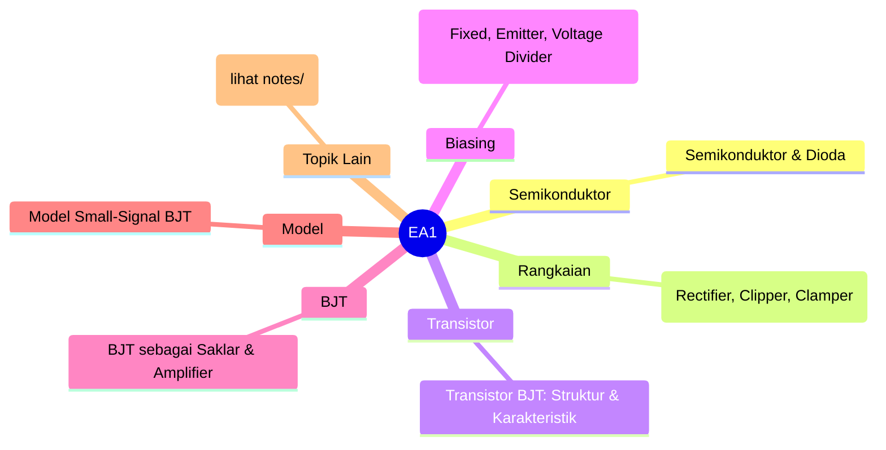
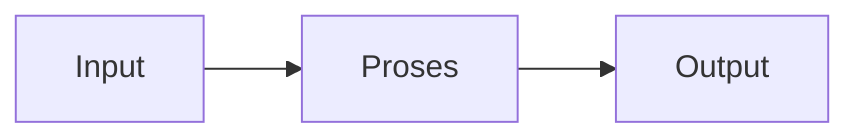

# Elektronika Analog 1 (REC242002)
> Bidang: Inti | Target Pemahaman: _Saya isi sendiri_

---

## 🗺️ Peta Topik




> 💡 **Tips**: Edit mindmap di atas sesuai pemahamanmu. Tambahkan cabang baru saat mempelajari konsep tambahan.

---

## 📌 Fokus Belajar Saat Ini

- [ ] Review daftar topik di bawah
- [ ] Pilih 1-2 topik untuk dipelajari minggu ini
- [ ] Kerjakan latihan soal terkait
- [ ] Dokumentasikan insight di notes/

### Daftar Topik Lengkap

- [ ] Semikonduktor & Dioda
- [ ] Rangkaian Dioda (Rectifier, Clipper, Clamper)
- [ ] Transistor BJT: Struktur & Karakteristik
- [ ] Biasing BJT (Fixed, Emitter, Voltage Divider)
- [ ] BJT sebagai Saklar & Amplifier
- [ ] Model Small-Signal BJT
- [ ] Konfigurasi Amplifier BJT (CE, CC, CB)
- [ ] JFET & MOSFET Dasar
- [ ] Biasing & Amplifier FET
- [ ] Frequency Response Amplifier


---

## 📐 Konsep & Rumus Kunci

> Tulis penjelasan konsep dengan bahasamu sendiri di sini.

| Nama | Rumus |
|------|-------|
| Dioda Shockley | `$$ I_D = I_S(e^{V_D/V_T} - 1) $$` |
| Arus BJT | `$$ I_E = I_B + I_C, \quad I_C = \beta I_B $$` |
| Transkonduktansi | `$$ g_m = \frac{I_C}{V_T} $$` |
| Gain CE | `$$ A_v = -g_m R_C $$` |
| Input Impedance | `$$ Z_{in} = R_1 || R_2 || \beta r_e $$` |
| MOSFET Saturation | `$$ I_D = \frac{1}{2}k_n(V_{GS} - V_{th})^2 $$` |


### Catatan Pemahaman

| Konsep | Pemahaman Saya | Contoh Aplikasi | Masih Bingung? |
|--------|----------------|-----------------|----------------|
| ... | ... | ... | [ ] Ya / [x] Tidak |

---

## 🔧 Praktikum / Simulasi

### Eksperimen yang Tersedia

- [ ] Karakterisasi dioda & LED
- [ ] Rectifier half-wave & full-wave
- [ ] Clipper & clamper circuits
- [ ] Biasing BJT & Q-point
- [ ] Amplifier Common Emitter
- [ ] Amplifier Common Collector (Emitter Follower)


### Template Laporan Praktikum

```markdown
## Judul Percobaan: ________________

### Tujuan
- 

### Alat & Bahan
- 

### Skema Rangkaian / Setup


### Langkah Kerja
1. 
2. 
3. 

### Hasil Pengamatan

| No | Parameter | Nilai Teori | Nilai Praktik | Error (%) |
|----|-----------|-------------|---------------|-----------|
| 1  |           |             |               |           |

### Analisis & Kesimpulan


```

---

## ❓ Catatan Pertanyaan & Insight

> Tempat mencatat: "Kenapa begini?", "Bagaimana jika...?", "Hubungan dengan topik X?"

### 💡 Insight Hari Ini
- 

### 🔍 Pertanyaan yang Belum Terjawab
- 

### 🔗 Koneksi ke Topik Lain
- Lihat juga: [Matkul Terkait](../../README.md)

---

## 🔗 Referensi Saya

### Buku Wajib
- [ ] Electronic Devices and Circuit Theory - Boylestad
- [ ] Microelectronic Circuits - Sedra & Smith
- [ ] The Art of Electronics - Horowitz & Hill


### Video Tutorial
- [ ] YouTube: Cari channel "GreatScott!", "EEVblog", "The Engineering Mindset"
- [ ] Coursera / edX courses

### Datasheet & Manual
- [ ] [DigiKey](https://www.digikey.com/)
- [ ] [Mouser](https://www.mouser.com/)
- [ ] [AllAboutCircuits](https://www.allaboutcircuits.com/)

### Simulator Online
- [ ] [Falstad Circuit Simulator](https://falstad.com/circuit/)
- [ ] [LTspice](https://www.analog.com/en/design-center/design-tools-and-calculators/ltspice-simulator.html)
- [ ] [Tinkercad](https://www.tinkercad.com/)

---

## 🔄 Riwayat Update

| Tanggal | Progress | Catatan |
|---------|----------|---------|
| 2026-06-01 | Initial setup | Script auto-fill konten |

---

**[⬅️ Kembali ke Dashboard Semester](../README.md)** | **[🏠 Ke Dashboard Utama](../../README.md)**

---

> 📝 **Catatan**: Template ini sudah diisi dengan konten spesifik Elektronika Analog 1. 
> Edit sesuai kebutuhan, tambah catatan pribadi, dan lengkapi dengan pemahamanmu sendiri!
