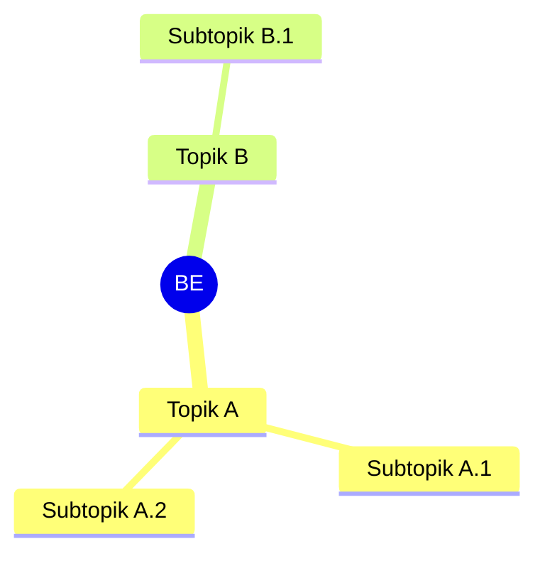

# Bengkel Elektronika (REC242003)
> Bidang: Praktikum | Target Pemahaman: _Saya isi sendiri_

---

## 🗺️ Peta Topik



> 💡 **Tips**: Edit mindmap di atas sesuai pemahamanmu. Tambahkan cabang baru saat mempelajari konsep tambahan.

---

## 📌 Fokus Belajar Saat Ini

- [ ] Topik prioritas pertama
- [ ] Topik prioritas kedua
- [ ] Latihan soal terkait
- [ ] Review konsep yang belum dipahami

---

## 📐 Konsep & Rumus Kunci

> Saya tulis rumus, derivasi, atau penjelasan konsep di sini.

### Contoh Format Rumus LaTeX

$$ \int x \, dx = 0.5 x^2 + C $$

$$ V = I \cdot R $$

$$ H(s) = \frac{Y(s)}{X(s)} = \frac{b_0}{a_n s^n + a_{n-1} s^{n-1} + \dots + a_0} $$

### Catatan Konsep

| Konsep | Penjelasan | Contoh Aplikasi |
|--------|------------|-----------------|
| ...    | ...        | ...             |

---

## 🔧 Praktikum / Simulasi

### Eksperimen Pertama: _Judul Percobaan_

- [ ] Skema rangkaian / flowchart
- [ ] Kode program / pseudocode
- [ ] Hasil pengamatan & analisis

```python
# Contoh kode simulasi
def contoh_fungsi():
    pass
```

### Hasil Pengamatan

| Variabel | Nilai | Satuan | Keterangan |
|----------|-------|--------|------------|
| ...      | ...   | ...    | ...        |

---

## ❓ Catatan Pertanyaan & Insight

> Tempat mencatat: "Kenapa begini?", "Bagaimana jika...?", "Hubungan dengan topik X?"

- 🔍 **Pertanyaan**: Mengapa tegangan output tidak stabil?
- 💡 **Insight**: Ternyata ada pengaruh temperatur pada komponen semiconductor.
- 🔗 **Koneksi ke topik lain**: Lihat juga di [Sensor & Aktuator](../../2024-2/REC242004-sensor-aktuator/README.md)

---

## 🔗 Referensi Saya

### Buku
- [ ] _Judul Buku_, Penulis, Tahun

### Video
- [ ] [Judul Video](URL)

### Datasheet / Manual
- [ ] [Nama Komponen](URL)

### Link Eksternal
- [ ] [Artikel / Tutorial](URL)

---

## 🔄 Riwayat Update

| Tanggal | Perubahan |
|---------|-----------|
| 2026-06-01 | Initial setup |

---

**[⬅️ Kembali ke Dashboard Semester](../README.md)** | **[🏠 Ke Dashboard Utama](../../README.md)**
