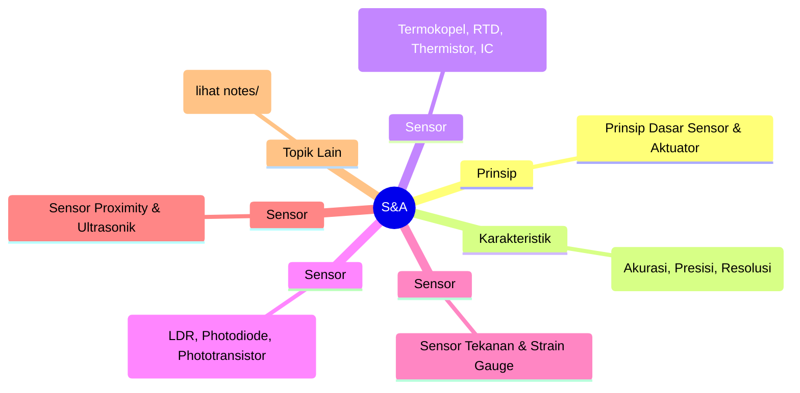
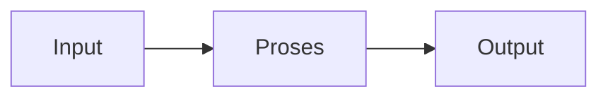

# Sensor & Aktuator (REC242004)
> Bidang: Inti | Target Pemahaman: _Saya isi sendiri_

---

## 🗺️ Peta Topik




> 💡 **Tips**: Edit mindmap di atas sesuai pemahamanmu. Tambahkan cabang baru saat mempelajari konsep tambahan.

---

## 📌 Fokus Belajar Saat Ini

- [ ] Review daftar topik di bawah
- [ ] Pilih 1-2 topik untuk dipelajari minggu ini
- [ ] Kerjakan latihan soal terkait
- [ ] Dokumentasikan insight di notes/

### Daftar Topik Lengkap

- [ ] Prinsip Dasar Sensor & Aktuator
- [ ] Karakteristik Sensor (Akurasi, Presisi, Resolusi)
- [ ] Sensor Suhu (Termokopel, RTD, Thermistor, IC)
- [ ] Sensor Cahaya (LDR, Photodiode, Phototransistor)
- [ ] Sensor Tekanan & Strain Gauge
- [ ] Sensor Proximity & Ultrasonik
- [ ] Sensor Posisi & Encoder
- [ ] Aktuator: Motor DC, Servo, Stepper
- [ ] Aktuator: Solenoid, Relay, Pneumatik
- [ ] Signal Conditioning & Interface


---

## 📐 Konsep & Rumus Kunci

> Tulis penjelasan konsep dengan bahasamu sendiri di sini.

| Nama | Rumus |
|------|-------|
| Sensitivitas | `$$ S = \frac{\Delta V_{out}}{\Delta Input} $$` |
| Termokopel | `$$ V = \alpha(T_{hot} - T_{cold}) $$` |
| Strain Gauge | `$$ \frac{\Delta R}{R} = G \cdot \epsilon $$` |
| Ultrasonik Distance | `$$ d = \frac{v \cdot t}{2} $$` |
| Stepper Steps | `$$ \text{Steps/rev} = \frac{360^\circ}{\text{step angle}} $$` |


### Catatan Pemahaman

| Konsep | Pemahaman Saya | Contoh Aplikasi | Masih Bingung? |
|--------|----------------|-----------------|----------------|
| ... | ... | ... | [ ] Ya / [x] Tidak |

---

## 🔧 Praktikum / Simulasi

### Eksperimen yang Tersedia

- [ ] Kalibrasi sensor suhu
- [ ] Light meter dengan LDR/photodiode
- [ ] Load cell dengan strain gauge
- [ ] Distance measurement dengan HC-SR04
- [ ] Control motor DC dengan PWM
- [ ] Control servo dengan Arduino


### Template Laporan Praktikum

```markdown
## Judul Percobaan: ________________

### Tujuan
- 

### Alat & Bahan
- 

### Skema Rangkaian / Setup


### Langkah Kerja
1. 
2. 
3. 

### Hasil Pengamatan

| No | Parameter | Nilai Teori | Nilai Praktik | Error (%) |
|----|-----------|-------------|---------------|-----------|
| 1  |           |             |               |           |

### Analisis & Kesimpulan


```

---

## ❓ Catatan Pertanyaan & Insight

> Tempat mencatat: "Kenapa begini?", "Bagaimana jika...?", "Hubungan dengan topik X?"

### 💡 Insight Hari Ini
- 

### 🔍 Pertanyaan yang Belum Terjawab
- 

### 🔗 Koneksi ke Topik Lain
- Lihat juga: [Matkul Terkait](../../README.md)

---

## 🔗 Referensi Saya

### Buku Wajib
- [ ] Measurement and Instrumentation - Morris
- [ ] Sensors and Actuators for Mechatronics - Barthelmes
- [ ] Datasheet berbagai sensor (DigiKey, Mouser)


### Video Tutorial
- [ ] YouTube: Cari channel "GreatScott!", "EEVblog", "The Engineering Mindset"
- [ ] Coursera / edX courses

### Datasheet & Manual
- [ ] [DigiKey](https://www.digikey.com/)
- [ ] [Mouser](https://www.mouser.com/)
- [ ] [AllAboutCircuits](https://www.allaboutcircuits.com/)

### Simulator Online
- [ ] [Falstad Circuit Simulator](https://falstad.com/circuit/)
- [ ] [LTspice](https://www.analog.com/en/design-center/design-tools-and-calculators/ltspice-simulator.html)
- [ ] [Tinkercad](https://www.tinkercad.com/)

---

## 🔄 Riwayat Update

| Tanggal | Progress | Catatan |
|---------|----------|---------|
| 2026-06-01 | Initial setup | Script auto-fill konten |

---

**[⬅️ Kembali ke Dashboard Semester](../README.md)** | **[🏠 Ke Dashboard Utama](../../README.md)**

---

> 📝 **Catatan**: Template ini sudah diisi dengan konten spesifik Sensor & Aktuator. 
> Edit sesuai kebutuhan, tambah catatan pribadi, dan lengkapi dengan pemahamanmu sendiri!
