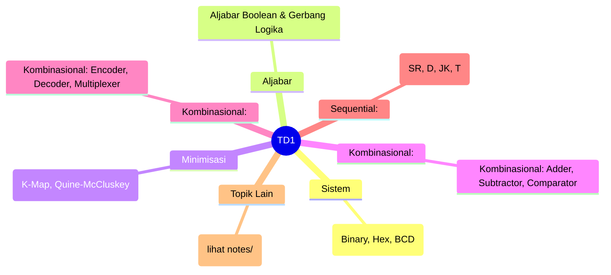
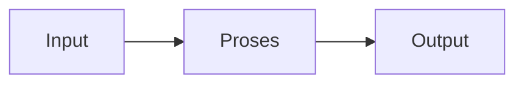

# Teknik Digital 1 (REC242005)
> Bidang: Inti | Target Pemahaman: _Saya isi sendiri_

---

## 🗺️ Peta Topik




> 💡 **Tips**: Edit mindmap di atas sesuai pemahamanmu. Tambahkan cabang baru saat mempelajari konsep tambahan.

---

## 📌 Fokus Belajar Saat Ini

- [ ] Review daftar topik di bawah
- [ ] Pilih 1-2 topik untuk dipelajari minggu ini
- [ ] Kerjakan latihan soal terkait
- [ ] Dokumentasikan insight di notes/

### Daftar Topik Lengkap

- [ ] Sistem Bilangan & Kode (Binary, Hex, BCD)
- [ ] Aljabar Boolean & Gerbang Logika
- [ ] Minimisasi Fungsi (K-Map, Quine-McCluskey)
- [ ] Kombinasional: Adder, Subtractor, Comparator
- [ ] Kombinasional: Encoder, Decoder, Multiplexer
- [ ] Sequential: Latch & Flip-Flop (SR, D, JK, T)
- [ ] Counter & Register
- [ ] Memory: ROM, RAM, EEPROM
- [ ] Logic Families: TTL, CMOS
- [ ] Introduction to PLD/FPGA


---

## 📐 Konsep & Rumus Kunci

> Tulis penjelasan konsep dengan bahasamu sendiri di sini.

| Nama | Rumus |
|------|-------|
| De Morgan | `$$ \overline{A \cdot B} = \overline{A} + \overline{B} $$` |
| Full Adder Sum | `$$ S = A \oplus B \oplus C_{in} $$` |
| Full Adder Carry | `$$ C_{out} = AB + C_{in}(A \oplus B) $$` |
| JK Flip-Flop | `$$ Q_{next} = J\overline{Q} + \overline{K}Q $$` |
| Frekuensi Counter | `$$ f_{out} = \frac{f_{clk}}{2^n} $$` |


### Catatan Pemahaman

| Konsep | Pemahaman Saya | Contoh Aplikasi | Masih Bingung? |
|--------|----------------|-----------------|----------------|
| ... | ... | ... | [ ] Ya / [x] Tidak |

---

## 🔧 Praktikum / Simulasi

### Eksperimen yang Tersedia

- [ ] Gerbang logika dasar (AND, OR, NOT, XOR)
- [ ] Implementasi fungsi Boolean dengan K-Map
- [ ] Rangkaian adder 4-bit
- [ ] Decoder 7-segment display
- [ ] Multiplexer 4-to-1
- [ ] Counter asynchronous & synchronous


### Template Laporan Praktikum

```markdown
## Judul Percobaan: ________________

### Tujuan
- 

### Alat & Bahan
- 

### Skema Rangkaian / Setup


### Langkah Kerja
1. 
2. 
3. 

### Hasil Pengamatan

| No | Parameter | Nilai Teori | Nilai Praktik | Error (%) |
|----|-----------|-------------|---------------|-----------|
| 1  |           |             |               |           |

### Analisis & Kesimpulan


```

---

## ❓ Catatan Pertanyaan & Insight

> Tempat mencatat: "Kenapa begini?", "Bagaimana jika...?", "Hubungan dengan topik X?"

### 💡 Insight Hari Ini
- 

### 🔍 Pertanyaan yang Belum Terjawab
- 

### 🔗 Koneksi ke Topik Lain
- Lihat juga: [Matkul Terkait](../../README.md)

---

## 🔗 Referensi Saya

### Buku Wajib
- [ ] Digital Design - Mano
- [ ] Fundamentals of Digital Logic - Brown & Vranesic
- [ ] The Art of Electronics - Horowitz


### Video Tutorial
- [ ] YouTube: Cari channel "GreatScott!", "EEVblog", "The Engineering Mindset"
- [ ] Coursera / edX courses

### Datasheet & Manual
- [ ] [DigiKey](https://www.digikey.com/)
- [ ] [Mouser](https://www.mouser.com/)
- [ ] [AllAboutCircuits](https://www.allaboutcircuits.com/)

### Simulator Online
- [ ] [Falstad Circuit Simulator](https://falstad.com/circuit/)
- [ ] [LTspice](https://www.analog.com/en/design-center/design-tools-and-calculators/ltspice-simulator.html)
- [ ] [Tinkercad](https://www.tinkercad.com/)

---

## 🔄 Riwayat Update

| Tanggal | Progress | Catatan |
|---------|----------|---------|
| 2026-06-01 | Initial setup | Script auto-fill konten |

---

**[⬅️ Kembali ke Dashboard Semester](../README.md)** | **[🏠 Ke Dashboard Utama](../../README.md)**

---

> 📝 **Catatan**: Template ini sudah diisi dengan konten spesifik Teknik Digital 1. 
> Edit sesuai kebutuhan, tambah catatan pribadi, dan lengkapi dengan pemahamanmu sendiri!
