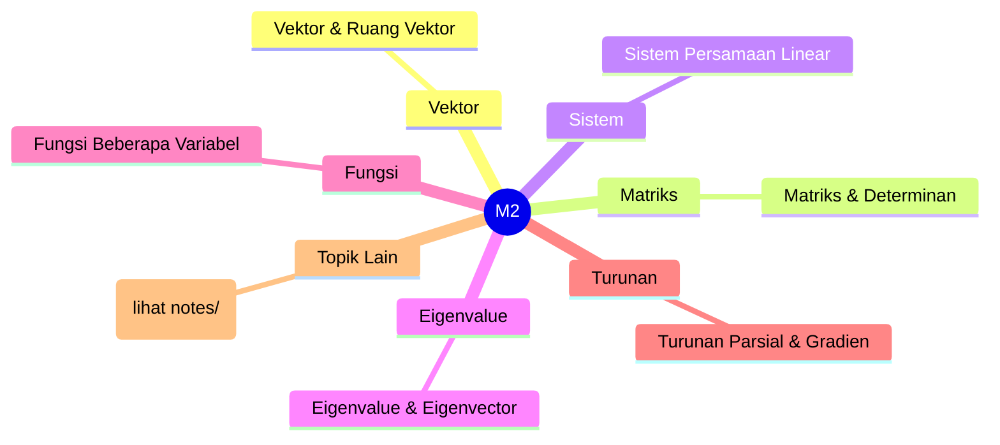
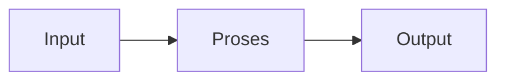

# Matematika 2 (REC242006)
> Bidang: Dasar | Target Pemahaman: _Saya isi sendiri_

---

## 🗺️ Peta Topik




> 💡 **Tips**: Edit mindmap di atas sesuai pemahamanmu. Tambahkan cabang baru saat mempelajari konsep tambahan.

---

## 📌 Fokus Belajar Saat Ini

- [ ] Review daftar topik di bawah
- [ ] Pilih 1-2 topik untuk dipelajari minggu ini
- [ ] Kerjakan latihan soal terkait
- [ ] Dokumentasikan insight di notes/

### Daftar Topik Lengkap

- [ ] Vektor & Ruang Vektor
- [ ] Matriks & Determinan
- [ ] Sistem Persamaan Linear
- [ ] Eigenvalue & Eigenvector
- [ ] Fungsi Beberapa Variabel
- [ ] Turunan Parsial & Gradien
- [ ] Integral Lipat Dua & Tiga
- [ ] Integral Garis & Permukaan
- [ ] Teorema Green, Stokes, Divergensi
- [ ] Persamaan Diferensial Biasa (ODE)


---

## 📐 Konsep & Rumus Kunci

> Tulis penjelasan konsep dengan bahasamu sendiri di sini.

| Nama | Rumus |
|------|-------|
| Dot Product | `$$ \mathbf{a} \cdot \mathbf{b} = |\mathbf{a}||\mathbf{b}|\cos\theta $$` |
| Cross Product | `$$ \mathbf{a} \times \mathbf{b} = |\mathbf{a}||\mathbf{b}|\sin\theta \, \mathbf{n} $$` |
| Determinan | `$$ \det(A) = ad - bc \text{ (2x2)} $$` |
| Eigenvalue | `$$ A\mathbf{v} = \lambda\mathbf{v} $$` |
| Gradien | `$$ \nabla f = \frac{\partial f}{\partial x}\mathbf{i} + \frac{\partial f}{\partial y}\mathbf{j} $$` |
| Divergensi | `$$ \nabla \cdot \mathbf{F} $$` |
| Curl | `$$ \nabla \times \mathbf{F} $$` |
| ODE Orde-1 | `$$ \frac{dy}{dx} + P(x)y = Q(x) $$` |


### Catatan Pemahaman

| Konsep | Pemahaman Saya | Contoh Aplikasi | Masih Bingung? |
|--------|----------------|-----------------|----------------|
| ... | ... | ... | [ ] Ya / [x] Tidak |

---

## 🔧 Praktikum / Simulasi

### Eksperimen yang Tersedia

- [ ] Operasi vektor & matriks dengan Python/NumPy
- [ ] Solusi SPL dengan eliminasi Gauss
- [ ] Visualisasi medan vektor
- [ ] Perhitungan integral lipat dengan MATLAB
- [ ] Solusi ODE dengan metode Euler & Runge-Kutta


### Template Laporan Praktikum

```markdown
## Judul Percobaan: ________________

### Tujuan
- 

### Alat & Bahan
- 

### Skema Rangkaian / Setup


### Langkah Kerja
1. 
2. 
3. 

### Hasil Pengamatan

| No | Parameter | Nilai Teori | Nilai Praktik | Error (%) |
|----|-----------|-------------|---------------|-----------|
| 1  |           |             |               |           |

### Analisis & Kesimpulan


```

---

## ❓ Catatan Pertanyaan & Insight

> Tempat mencatat: "Kenapa begini?", "Bagaimana jika...?", "Hubungan dengan topik X?"

### 💡 Insight Hari Ini
- 

### 🔍 Pertanyaan yang Belum Terjawab
- 

### 🔗 Koneksi ke Topik Lain
- Lihat juga: [Matkul Terkait](../../README.md)

---

## 🔗 Referensi Saya

### Buku Wajib
- [ ] Advanced Engineering Mathematics - Kreyszig
- [ ] Linear Algebra - Gilbert Strang
- [ ] Calculus Vol. 3 - Stewart


### Video Tutorial
- [ ] YouTube: Cari channel "GreatScott!", "EEVblog", "The Engineering Mindset"
- [ ] Coursera / edX courses

### Datasheet & Manual
- [ ] [DigiKey](https://www.digikey.com/)
- [ ] [Mouser](https://www.mouser.com/)
- [ ] [AllAboutCircuits](https://www.allaboutcircuits.com/)

### Simulator Online
- [ ] [Falstad Circuit Simulator](https://falstad.com/circuit/)
- [ ] [LTspice](https://www.analog.com/en/design-center/design-tools-and-calculators/ltspice-simulator.html)
- [ ] [Tinkercad](https://www.tinkercad.com/)

---

## 🔄 Riwayat Update

| Tanggal | Progress | Catatan |
|---------|----------|---------|
| 2026-06-01 | Initial setup | Script auto-fill konten |

---

**[⬅️ Kembali ke Dashboard Semester](../README.md)** | **[🏠 Ke Dashboard Utama](../../README.md)**

---

> 📝 **Catatan**: Template ini sudah diisi dengan konten spesifik Matematika 2. 
> Edit sesuai kebutuhan, tambah catatan pribadi, dan lengkapi dengan pemahamanmu sendiri!
