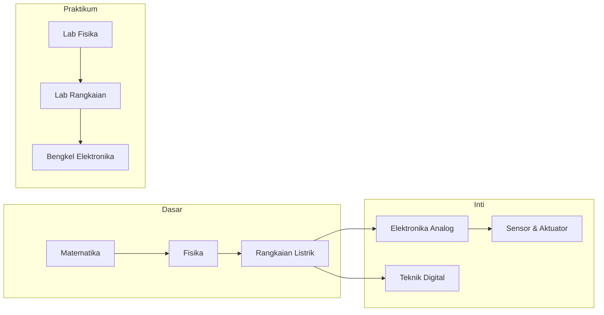

# Semester 2025-1 - 2025 / 1

> 📚 Daftar mata kuliah dan progres belajar semester ini.

---

## 📊 Ringkasan Semester

| Kode | Mata Kuliah | Kategori | Status |
|------|-------------|----------|--------|
| REC243001 | [Elektronika Analog 2](./REC243001-elektronika-analog-2/README.md) | Inti | ⚪ Belum Mulai |
| REC243002 | [Sistem Mikrokontroler](./REC243002-sistem-mikrokontroler/README.md) | Spesialisasi | ⚪ Belum Mulai |
| REC243003 | [Instrumentasi Industri](./REC243003-instrumentasi-industri/README.md) | Spesialisasi | ⚪ Belum Mulai |
| REC243004 | [PLC](./REC243004-plc/README.md) | Spesialisasi | ⚪ Belum Mulai |
| REC243005 | [Sistem Kendali Kontinyu](./REC243005-sistem-kendali-kontinyu/README.md) | Spesialisasi | ⚪ Belum Mulai |
| REC243006 | [Elektronika Digital](./REC243006-elektronika-digital/README.md) | Inti | ⚪ Belum Mulai |

> ✅ **Status**: Isi manual sesuai progresmu (Belum Mulai / Dalam Proses / Dipahami / Perlu Review)

---

## 🗺️ Alur Belajar Semester Ini



---

## 🎯 Target Pembelajaran Semester Ini

1. **Pemahaman Konsep**: Kuasai fondasi teori di setiap mata kuliah
2. **Keterampilan Praktis**: Selesaikan minimal 1 proyek kecil per matkul praktikum
3. **Koneksi Antar Topik**: Identifikasi hubungan antara mata kuliah (misal: Matematika → Rangkaian → Kontrol)

---

## 📁 Struktur Folder

```
2025-1/
├── REC243001-elektronika-analog-2/
│   ├── README.md       # Template belajar fleksibel
│   ├── notes/          # Catatan harian, konsep, ringkasan
│   ├── problems/       # Soal latihan & pembahasan
│   ├── labs/           # Laporan praktikum, skema, hasil simulasi
│   └── references/     # Link buku, video, paper, datasheet
├── ...
└── (lihat navigasi cepat di bawah)
```

---

## 🔗 Navigasi Cepat

- 📘 [Elektronika Analog 2](./REC243001-elektronika-analog-2/README.md)
- 📘 [Sistem Mikrokontroler](./REC243002-sistem-mikrokontroler/README.md)
- 📘 [Instrumentasi Industri](./REC243003-instrumentasi-industri/README.md)
- 📘 [PLC](./REC243004-plc/README.md)
- 📘 [Sistem Kendali Kontinyu](./REC243005-sistem-kendali-kontinyu/README.md)
- 📘 [Elektronika Digital](./REC243006-elektronika-digital/README.md)

---

**[⬅️ Kembali ke Dashboard Utama](../../README.md)** | **[➡️ Lanjut ke Topik Lintas-Matkul](../../topics/README.md)**
