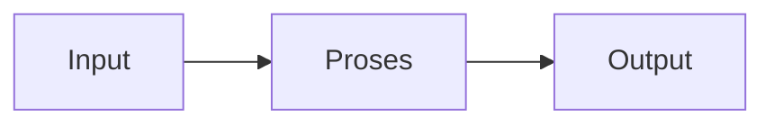

# Elektronika Analog 2 (REC243001)
> Bidang: Inti | Target Pemahaman: _Saya isi sendiri_

---

## 🗺️ Peta Topik

```mermaid
mindmap
  root((EA2))
    Amplifier
      Amplifier Diferensial
    Operational
      Operational Amplifier (Op-Amp) Ideal
    Konfigurasi
      Konfigurasi Op-Amp (Inverting, Non-Inverting, Buffer)
    Aplikasi
      Aplikasi Op-Amp (Summing, Integrator, Differentiator)
    Op-Amp
      Op-Amp Non-Ideal (Offset, Bandwidth, Slew Rate)
    Feedback
      Feedback & Stabilitas
    Topik Lain
      (lihat notes/)
```


> 💡 **Tips**: Edit mindmap di atas sesuai pemahamanmu. Tambahkan cabang baru saat mempelajari konsep tambahan.

---

## 📌 Fokus Belajar Saat Ini

- [ ] Review daftar topik di bawah
- [ ] Pilih 1-2 topik untuk dipelajari minggu ini
- [ ] Kerjakan latihan soal terkait
- [ ] Dokumentasikan insight di notes/

### Daftar Topik Lengkap

- [ ] Amplifier Diferensial
- [ ] Operational Amplifier (Op-Amp) Ideal
- [ ] Konfigurasi Op-Amp (Inverting, Non-Inverting, Buffer)
- [ ] Aplikasi Op-Amp (Summing, Integrator, Differentiator)
- [ ] Op-Amp Non-Ideal (Offset, Bandwidth, Slew Rate)
- [ ] Feedback & Stabilitas
- [ ] Oscillator (RC, LC, Crystal)
- [ ] Active Filters (Butterworth, Chebyshev)
- [ ] Voltage Regulator (Linear, Switching)
- [ ] PLL & Applications


---

## 📐 Konsep & Rumus Kunci

> Tulis penjelasan konsep dengan bahasamu sendiri di sini.

| Nama | Rumus |
|------|-------|
| Gain Inverting | `$$ A_v = -\frac{R_f}{R_{in}} $$` |
| Gain Non-Inverting | `$$ A_v = 1 + \frac{R_f}{R_g} $$` |
| Integrator | `$$ V_{out} = -\frac{1}{RC}\int V_{in} dt $$` |
| Differentiator | `$$ V_{out} = -RC\frac{dV_{in}}{dt} $$` |
| Bandwidth | `$$ GBW = A_v \cdot f_c $$` |
| Slew Rate | `$$ SR = \frac{dV_{out}}{dt}|_{max} $$` |
| Wien Bridge | `$$ f_0 = \frac{1}{2\pi RC} $$` |


### Catatan Pemahaman

| Konsep | Pemahaman Saya | Contoh Aplikasi | Masih Bingung? |
|--------|----------------|-----------------|----------------|
| ... | ... | ... | [ ] Ya / [x] Tidak |

---

## 🔧 Praktikum / Simulasi

### Eksperimen yang Tersedia

- [ ] Characterization Op-Amp 741/LM358
- [ ] Inverting & non-inverting amplifier
- [ ] Summing amplifier (mixer audio)
- [ ] Integrator & differentiator
- [ ] Active LPF/HPF design
- [ ] Wien bridge oscillator


### Template Laporan Praktikum

```markdown
## Judul Percobaan: ________________

### Tujuan
- 

### Alat & Bahan
- 

### Skema Rangkaian / Setup


### Langkah Kerja
1. 
2. 
3. 

### Hasil Pengamatan

| No | Parameter | Nilai Teori | Nilai Praktik | Error (%) |
|----|-----------|-------------|---------------|-----------|
| 1  |           |             |               |           |

### Analisis & Kesimpulan


```

---

## ❓ Catatan Pertanyaan & Insight

> Tempat mencatat: "Kenapa begini?", "Bagaimana jika...?", "Hubungan dengan topik X?"

### 💡 Insight Hari Ini
- 

### 🔍 Pertanyaan yang Belum Terjawab
- 

### 🔗 Koneksi ke Topik Lain
- Lihat juga: [Matkul Terkait](../../README.md)

---

## 🔗 Referensi Saya

### Buku Wajib
- [ ] Op-Amps for Everyone - Mancini
- [ ] Microelectronic Circuits - Sedra/Smith
- [ ] Analog Devices tutorials


### Video Tutorial
- [ ] YouTube: Cari channel "GreatScott!", "EEVblog", "The Engineering Mindset"
- [ ] Coursera / edX courses

### Datasheet & Manual
- [ ] [DigiKey](https://www.digikey.com/)
- [ ] [Mouser](https://www.mouser.com/)
- [ ] [AllAboutCircuits](https://www.allaboutcircuits.com/)

### Simulator Online
- [ ] [Falstad Circuit Simulator](https://falstad.com/circuit/)
- [ ] [LTspice](https://www.analog.com/en/design-center/design-tools-and-calculators/ltspice-simulator.html)
- [ ] [Tinkercad](https://www.tinkercad.com/)

---

## 🔄 Riwayat Update

| Tanggal | Progress | Catatan |
|---------|----------|---------|
| 2026-06-01 | Initial setup | Script auto-fill konten |

---

**[⬅️ Kembali ke Dashboard Semester](../README.md)** | **[🏠 Ke Dashboard Utama](../../README.md)**

---

> 📝 **Catatan**: Template ini sudah diisi dengan konten spesifik Elektronika Analog 2. 
> Edit sesuai kebutuhan, tambah catatan pribadi, dan lengkapi dengan pemahamanmu sendiri!
