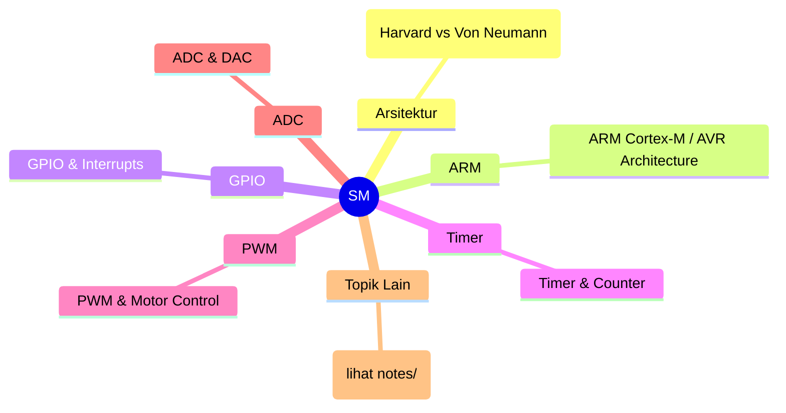
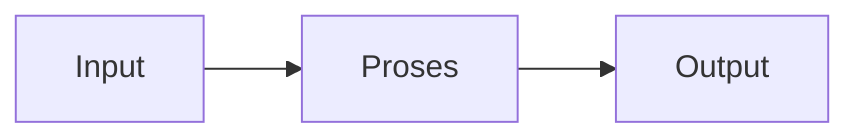

# Sistem Mikrokontroler (REC243002)
> Bidang: Inti | Target Pemahaman: _Saya isi sendiri_

---

## 🗺️ Peta Topik




> 💡 **Tips**: Edit mindmap di atas sesuai pemahamanmu. Tambahkan cabang baru saat mempelajari konsep tambahan.

---

## 📌 Fokus Belajar Saat Ini

- [ ] Review daftar topik di bawah
- [ ] Pilih 1-2 topik untuk dipelajari minggu ini
- [ ] Kerjakan latihan soal terkait
- [ ] Dokumentasikan insight di notes/

### Daftar Topik Lengkap

- [ ] Arsitektur Mikrokontroler (Harvard vs Von Neumann)
- [ ] ARM Cortex-M / AVR Architecture
- [ ] GPIO & Interrupts
- [ ] Timer & Counter
- [ ] PWM & Motor Control
- [ ] ADC & DAC
- [ ] Serial Communication (UART, SPI, I2C)
- [ ] Watchdog Timer & Low Power Modes
- [ ] Embedded C Programming
- [ ] RTOS Basics (FreeRTOS)


---

## 📐 Konsep & Rumus Kunci

> Tulis penjelasan konsep dengan bahasamu sendiri di sini.

| Nama | Rumus |
|------|-------|
| PWM Duty Cycle | `$$ D = \frac{T_{on}}{T_{total}} \times 100\% $$` |
| ADC Resolution | `$$ V_{step} = \frac{V_{ref}}{2^n} $$` |
| UART Baud Rate | `$$ Baud = \frac{f_{clk}}{16 \cdot UBRR} $$` |
| SPI Clock | `$$ f_{SPI} = \frac{f_{clk}}{2 \cdot prescaler} $$` |


### Catatan Pemahaman

| Konsep | Pemahaman Saya | Contoh Aplikasi | Masih Bingung? |
|--------|----------------|-----------------|----------------|
| ... | ... | ... | [ ] Ya / [x] Tidak |

---

## 🔧 Praktikum / Simulasi

### Eksperimen yang Tersedia

- [ ] LED blinking & GPIO input
- [ ] External interrupt dengan button
- [ ] Timer interrupt & millis()
- [ ] PWM untuk LED dimming & servo
- [ ] ADC membaca sensor analog
- [ ] UART communication dengan PC


### Template Laporan Praktikum

```markdown
## Judul Percobaan: ________________

### Tujuan
- 

### Alat & Bahan
- 

### Skema Rangkaian / Setup


### Langkah Kerja
1. 
2. 
3. 

### Hasil Pengamatan

| No | Parameter | Nilai Teori | Nilai Praktik | Error (%) |
|----|-----------|-------------|---------------|-----------|
| 1  |           |             |               |           |

### Analisis & Kesimpulan


```

---

## ❓ Catatan Pertanyaan & Insight

> Tempat mencatat: "Kenapa begini?", "Bagaimana jika...?", "Hubungan dengan topik X?"

### 💡 Insight Hari Ini
- 

### 🔍 Pertanyaan yang Belum Terjawab
- 

### 🔗 Koneksi ke Topik Lain
- Lihat juga: [Matkul Terkait](../../README.md)

---

## 🔗 Referensi Saya

### Buku Wajib
- [ ] Making Embedded Systems - Elecia White
- [ ] ARM Cortex-M Microcontroller Manuals
- [ ] Arduino & STM32 documentation
- [ ] FreeRTOS kernel guide


### Video Tutorial
- [ ] YouTube: Cari channel "GreatScott!", "EEVblog", "The Engineering Mindset"
- [ ] Coursera / edX courses

### Datasheet & Manual
- [ ] [DigiKey](https://www.digikey.com/)
- [ ] [Mouser](https://www.mouser.com/)
- [ ] [AllAboutCircuits](https://www.allaboutcircuits.com/)

### Simulator Online
- [ ] [Falstad Circuit Simulator](https://falstad.com/circuit/)
- [ ] [LTspice](https://www.analog.com/en/design-center/design-tools-and-calculators/ltspice-simulator.html)
- [ ] [Tinkercad](https://www.tinkercad.com/)

---

## 🔄 Riwayat Update

| Tanggal | Progress | Catatan |
|---------|----------|---------|
| 2026-06-01 | Initial setup | Script auto-fill konten |

---

**[⬅️ Kembali ke Dashboard Semester](../README.md)** | **[🏠 Ke Dashboard Utama](../../README.md)**

---

> 📝 **Catatan**: Template ini sudah diisi dengan konten spesifik Sistem Mikrokontroler. 
> Edit sesuai kebutuhan, tambah catatan pribadi, dan lengkapi dengan pemahamanmu sendiri!
