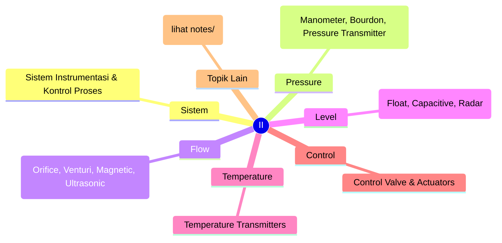
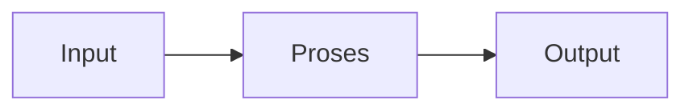

# Instrumentasi Industri (REC243003)
> Bidang: Spesialisasi | Target Pemahaman: _Saya isi sendiri_

---

## 🗺️ Peta Topik




> 💡 **Tips**: Edit mindmap di atas sesuai pemahamanmu. Tambahkan cabang baru saat mempelajari konsep tambahan.

---

## 📌 Fokus Belajar Saat Ini

- [ ] Review daftar topik di bawah
- [ ] Pilih 1-2 topik untuk dipelajari minggu ini
- [ ] Kerjakan latihan soal terkait
- [ ] Dokumentasikan insight di notes/

### Daftar Topik Lengkap

- [ ] Sistem Instrumentasi & Kontrol Proses
- [ ] Pressure Measurement (Manometer, Bourdon, Pressure Transmitter)
- [ ] Flow Measurement (Orifice, Venturi, Magnetic, Ultrasonic)
- [ ] Level Measurement (Float, Capacitive, Radar)
- [ ] Temperature Transmitters
- [ ] Control Valve & Actuators
- [ ] I/P Converter & Positioner
- [ ] Process Calibrator
- [ ] Industrial Communication (4-20mA, HART, Foundation Fieldbus)
- [ ] Safety Instrumented Systems (SIS)


---

## 📐 Konsep & Rumus Kunci

> Tulis penjelasan konsep dengan bahasamu sendiri di sini.

| Nama | Rumus |
|------|-------|
| Orifice Flow | `$$ Q = C_d A \sqrt{\frac{2\Delta P}{\rho}} $$` |
| Venturi | `$$ Q = \frac{A_1 A_2}{\sqrt{A_1^2 - A_2^2}}\sqrt{2g\Delta h} $$` |
| Hydrostatic Level | `$$ P = \rho g h $$` |
| 4-20mA Scaling | `$$ PV = \frac{I - 4}{16} \times (Range_{max} - Range_{min}) + Range_{min} $$` |


### Catatan Pemahaman

| Konsep | Pemahaman Saya | Contoh Aplikasi | Masih Bingung? |
|--------|----------------|-----------------|----------------|
| ... | ... | ... | [ ] Ya / [x] Tidak |

---

## 🔧 Praktikum / Simulasi

### Eksperimen yang Tersedia

- [ ] Kalibrasi pressure transmitter
- [ ] Flow measurement dengan orifice plate
- [ ] Level measurement capacitive
- [ ] Control valve characterization
- [ ] Loop checking 4-20mA
- [ ] HART communicator usage


### Template Laporan Praktikum

```markdown
## Judul Percobaan: ________________

### Tujuan
- 

### Alat & Bahan
- 

### Skema Rangkaian / Setup


### Langkah Kerja
1. 
2. 
3. 

### Hasil Pengamatan

| No | Parameter | Nilai Teori | Nilai Praktik | Error (%) |
|----|-----------|-------------|---------------|-----------|
| 1  |           |             |               |           |

### Analisis & Kesimpulan


```

---

## ❓ Catatan Pertanyaan & Insight

> Tempat mencatat: "Kenapa begini?", "Bagaimana jika...?", "Hubungan dengan topik X?"

### 💡 Insight Hari Ini
- 

### 🔍 Pertanyaan yang Belum Terjawab
- 

### 🔗 Koneksi ke Topik Lain
- Lihat juga: [Matkul Terkait](../../README.md)

---

## 🔗 Referensi Saya

### Buku Wajib
- [ ] Process Control Instrumentation - Curtis Johnson
- [ ] Instrument Engineers' Handbook - Bela Liptak
- [ ] ISA Standards


### Video Tutorial
- [ ] YouTube: Cari channel "GreatScott!", "EEVblog", "The Engineering Mindset"
- [ ] Coursera / edX courses

### Datasheet & Manual
- [ ] [DigiKey](https://www.digikey.com/)
- [ ] [Mouser](https://www.mouser.com/)
- [ ] [AllAboutCircuits](https://www.allaboutcircuits.com/)

### Simulator Online
- [ ] [Falstad Circuit Simulator](https://falstad.com/circuit/)
- [ ] [LTspice](https://www.analog.com/en/design-center/design-tools-and-calculators/ltspice-simulator.html)
- [ ] [Tinkercad](https://www.tinkercad.com/)

---

## 🔄 Riwayat Update

| Tanggal | Progress | Catatan |
|---------|----------|---------|
| 2026-06-01 | Initial setup | Script auto-fill konten |

---

**[⬅️ Kembali ke Dashboard Semester](../README.md)** | **[🏠 Ke Dashboard Utama](../../README.md)**

---

> 📝 **Catatan**: Template ini sudah diisi dengan konten spesifik Instrumentasi Industri. 
> Edit sesuai kebutuhan, tambah catatan pribadi, dan lengkapi dengan pemahamanmu sendiri!
