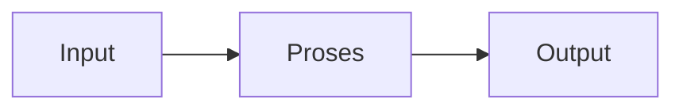

# PLC (Programmable Logic Controller) (REC243004)
> Bidang: Spesialisasi | Target Pemahaman: _Saya isi sendiri_

---

## 🗺️ Peta Topik

```mermaid
mindmap
  root((P(L))
    PLC
      PLC Architecture & Components
    I/O
      I/O Modules (Digital, Analog)
    Ladder
      Ladder Logic Programming
    Function
      Function Block Diagram (FBD)
    Structured
      Structured Text (ST)
    Timer
      Timer & Counter Instructions
    Topik Lain
      (lihat notes/)
```


> 💡 **Tips**: Edit mindmap di atas sesuai pemahamanmu. Tambahkan cabang baru saat mempelajari konsep tambahan.

---

## 📌 Fokus Belajar Saat Ini

- [ ] Review daftar topik di bawah
- [ ] Pilih 1-2 topik untuk dipelajari minggu ini
- [ ] Kerjakan latihan soal terkait
- [ ] Dokumentasikan insight di notes/

### Daftar Topik Lengkap

- [ ] PLC Architecture & Components
- [ ] I/O Modules (Digital, Analog)
- [ ] Ladder Logic Programming
- [ ] Function Block Diagram (FBD)
- [ ] Structured Text (ST)
- [ ] Timer & Counter Instructions
- [ ] Compare & Math Operations
- [ ] Data Handling (Move, Shift)
- [ ] Sequencer & Program Control
- [ ] HMI Integration & SCADA Basics


---

## 📐 Konsep & Rumus Kunci

> Tulis penjelasan konsep dengan bahasamu sendiri di sini.

| Nama | Rumus |
|------|-------|
| Scan Time | `$$ T_{scan} = T_{input} + T_{program} + T_{output} $$` |
| Resolution ADC PLC | `$$ 12-bit = 4096 steps $$` |


### Catatan Pemahaman

| Konsep | Pemahaman Saya | Contoh Aplikasi | Masih Bingung? |
|--------|----------------|-----------------|----------------|
| ... | ... | ... | [ ] Ya / [x] Tidak |

---

## 🔧 Praktikum / Simulasi

### Eksperimen yang Tersedia

- [ ] Wiring input/output PLC
- [ ] Ladder: start-stop motor
- [ ] Timer ON/OFF delay
- [ ] Counter up/down
- [ ] Sequence control conveyor
- [ ] Analog scaling (4-20mA to engineering units)


### Template Laporan Praktikum

```markdown
## Judul Percobaan: ________________

### Tujuan
- 

### Alat & Bahan
- 

### Skema Rangkaian / Setup


### Langkah Kerja
1. 
2. 
3. 

### Hasil Pengamatan

| No | Parameter | Nilai Teori | Nilai Praktik | Error (%) |
|----|-----------|-------------|---------------|-----------|
| 1  |           |             |               |           |

### Analisis & Kesimpulan


```

---

## ❓ Catatan Pertanyaan & Insight

> Tempat mencatat: "Kenapa begini?", "Bagaimana jika...?", "Hubungan dengan topik X?"

### 💡 Insight Hari Ini
- 

### 🔍 Pertanyaan yang Belum Terjawab
- 

### 🔗 Koneksi ke Topik Lain
- Lihat juga: [Matkul Terkait](../../README.md)

---

## 🔗 Referensi Saya

### Buku Wajib
- [ ] Programmable Logic Controllers - Frank Petruzella
- [ ] Siemens S7-1200/1500 manuals
- [ ] Allen-Bradley RSLogix tutorials
- [ ] IEC 61131-3 standard


### Video Tutorial
- [ ] YouTube: Cari channel "GreatScott!", "EEVblog", "The Engineering Mindset"
- [ ] Coursera / edX courses

### Datasheet & Manual
- [ ] [DigiKey](https://www.digikey.com/)
- [ ] [Mouser](https://www.mouser.com/)
- [ ] [AllAboutCircuits](https://www.allaboutcircuits.com/)

### Simulator Online
- [ ] [Falstad Circuit Simulator](https://falstad.com/circuit/)
- [ ] [LTspice](https://www.analog.com/en/design-center/design-tools-and-calculators/ltspice-simulator.html)
- [ ] [Tinkercad](https://www.tinkercad.com/)

---

## 🔄 Riwayat Update

| Tanggal | Progress | Catatan |
|---------|----------|---------|
| 2026-06-01 | Initial setup | Script auto-fill konten |

---

**[⬅️ Kembali ke Dashboard Semester](../README.md)** | **[🏠 Ke Dashboard Utama](../../README.md)**

---

> 📝 **Catatan**: Template ini sudah diisi dengan konten spesifik PLC (Programmable Logic Controller). 
> Edit sesuai kebutuhan, tambah catatan pribadi, dan lengkapi dengan pemahamanmu sendiri!
