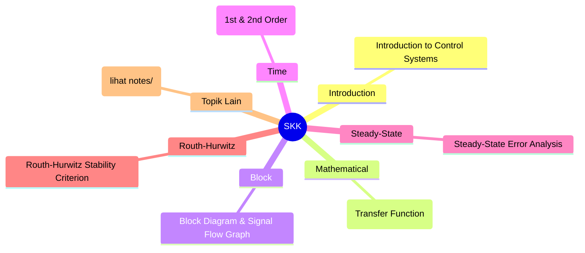
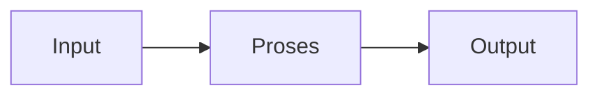

# Sistem Kendali Kontinyu (REC243005)
> Bidang: Inti | Target Pemahaman: _Saya isi sendiri_

---

## 🗺️ Peta Topik




> 💡 **Tips**: Edit mindmap di atas sesuai pemahamanmu. Tambahkan cabang baru saat mempelajari konsep tambahan.

---

## 📌 Fokus Belajar Saat Ini

- [ ] Review daftar topik di bawah
- [ ] Pilih 1-2 topik untuk dipelajari minggu ini
- [ ] Kerjakan latihan soal terkait
- [ ] Dokumentasikan insight di notes/

### Daftar Topik Lengkap

- [ ] Introduction to Control Systems
- [ ] Mathematical Modeling (Transfer Function)
- [ ] Block Diagram & Signal Flow Graph
- [ ] Time Response Analysis (1st & 2nd Order)
- [ ] Steady-State Error Analysis
- [ ] Routh-Hurwitz Stability Criterion
- [ ] Root Locus Method
- [ ] Frequency Response (Bode Plot)
- [ ] Nyquist Stability Criterion
- [ ] PID Controller Design


---

## 📐 Konsep & Rumus Kunci

> Tulis penjelasan konsep dengan bahasamu sendiri di sini.

| Nama | Rumus |
|------|-------|
| Transfer Function | `$$ G(s) = \frac{Y(s)}{X(s)} $$` |
| 1st Order Step | `$$ y(t) = K(1 - e^{-t/\tau}) $$` |
| 2nd Order | `$$ \frac{\omega_n^2}{s^2 + 2\zeta\omega_n s + \omega_n^2} $$` |
| Overshoot | `$$ \%OS = e^{-\pi\zeta/\sqrt{1-\zeta^2}} \times 100\% $$` |
| Settling Time | `$$ T_s \approx \frac{4}{\zeta\omega_n} $$` |
| PID | `$$ u(t) = K_p e(t) + K_i \int e(t)dt + K_d \frac{de(t)}{dt} $$` |
| Margin Stabilitas | `$$ GM, PM dari Bode $$` |


### Catatan Pemahaman

| Konsep | Pemahaman Saya | Contoh Aplikasi | Masih Bingung? |
|--------|----------------|-----------------|----------------|
| ... | ... | ... | [ ] Ya / [x] Tidak |

---

## 🔧 Praktikum / Simulasi

### Eksperimen yang Tersedia

- [ ] Modeling DC motor transfer function
- [ ] Step response analysis
- [ ] Routh-Hurwitz stability
- [ ] Root locus plotting (MATLAB)
- [ ] Bode plot analysis
- [ ] PID tuning (Ziegler-Nichols)


### Template Laporan Praktikum

```markdown
## Judul Percobaan: ________________

### Tujuan
- 

### Alat & Bahan
- 

### Skema Rangkaian / Setup


### Langkah Kerja
1. 
2. 
3. 

### Hasil Pengamatan

| No | Parameter | Nilai Teori | Nilai Praktik | Error (%) |
|----|-----------|-------------|---------------|-----------|
| 1  |           |             |               |           |

### Analisis & Kesimpulan


```

---

## ❓ Catatan Pertanyaan & Insight

> Tempat mencatat: "Kenapa begini?", "Bagaimana jika...?", "Hubungan dengan topik X?"

### 💡 Insight Hari Ini
- 

### 🔍 Pertanyaan yang Belum Terjawab
- 

### 🔗 Koneksi ke Topik Lain
- Lihat juga: [Matkul Terkait](../../README.md)

---

## 🔗 Referensi Saya

### Buku Wajib
- [ ] Automatic Control Systems - Kuo
- [ ] Modern Control Engineering - Ogata
- [ ] Control Systems Engineering - Nise


### Video Tutorial
- [ ] YouTube: Cari channel "GreatScott!", "EEVblog", "The Engineering Mindset"
- [ ] Coursera / edX courses

### Datasheet & Manual
- [ ] [DigiKey](https://www.digikey.com/)
- [ ] [Mouser](https://www.mouser.com/)
- [ ] [AllAboutCircuits](https://www.allaboutcircuits.com/)

### Simulator Online
- [ ] [Falstad Circuit Simulator](https://falstad.com/circuit/)
- [ ] [LTspice](https://www.analog.com/en/design-center/design-tools-and-calculators/ltspice-simulator.html)
- [ ] [Tinkercad](https://www.tinkercad.com/)

---

## 🔄 Riwayat Update

| Tanggal | Progress | Catatan |
|---------|----------|---------|
| 2026-06-01 | Initial setup | Script auto-fill konten |

---

**[⬅️ Kembali ke Dashboard Semester](../README.md)** | **[🏠 Ke Dashboard Utama](../../README.md)**

---

> 📝 **Catatan**: Template ini sudah diisi dengan konten spesifik Sistem Kendali Kontinyu. 
> Edit sesuai kebutuhan, tambah catatan pribadi, dan lengkapi dengan pemahamanmu sendiri!
