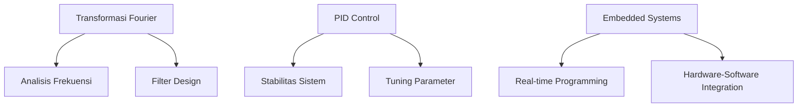

# 🧩 Topik Lintas-Matkul

> Koleksi topik yang menghubungkan konsep dari berbagai mata kuliah.

---

## 📋 Daftar Topik

| Topik | Mata Kuliah Terkait | Status |
|-------|---------------------|--------|
| Transformasi Fourier | Matematika 2, Elektronika Analog, Sistem Kendali | 🟡 Dalam Proses |
| PID Control | Rangkaian Listrik, Sistem Kendali, PLC | ⚪ Belum Mulai |
| Embedded Systems | Algoritma, Mikrokontroler, Instrumentasi | ⚪ Belum Mulai |
| Signal Conditioning | Sensor & Aktuator, Elektronika Analog, Instrumentasi | ⚪ Belum Mulai |

---

## 🗺️ Peta Koneksi Topik

---

## 📝 Template Topik Baru

### Nama Topik

**Mata Kuliah Terkait:**
- Matkul 1
- Matkul 2

**Konsep Kunci:**
- Konsep A
- Konsep B

**Aplikasi:**
- Deskripsi aplikasi di dunia nyata

**Referensi:**
- [Link 1]()
- [Link 2]()

---

**[⬅️ Kembali ke Dashboard Utama](../README.md)**
